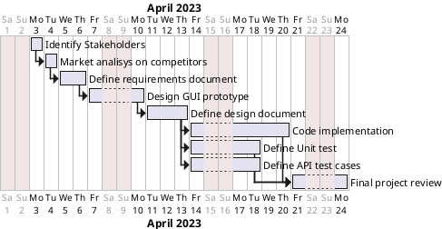

# Project Estimation - CURRENT
Date: 2023-04-19

Version: 1.0

# Estimation approach
Consider the EZWallet  project in CURRENT version (as received by the teachers), assume that you are going to develop the project INDEPENDENT of the deadlines of the course
# Estimate by size
### 
|                                                                                                         | Estimate |
| ------------------------------------------------------------------------------------------------------- | -------- |
| NC =  Estimated number of classes to be developed                                                       | 12       |
| A = Estimated average size per class, in LOC                                                            | 100      |
| S = Estimated size of project, in LOC (= NC * A)                                                        | 1200     |
| E = Estimated effort, in person hours (here use productivity 10 LOC per person hour)                    | 120 ph   |
| C = Estimated cost, in euro (here use 1 person hour cost = 30 euro)                                     | 320€     |
| Estimated calendar time, in calendar weeks (Assume team of 4 people, 8 hours per day, 5 days per week ) | 1 week   |

# Estimate by product decomposition
### 
| component name       | Estimated effort (person hours) |
| -------------------- | ------------------------------- |
| requirement document | 30 ph                           |
| GUI prototype        | 10 ph                           |
| design document      | 30 ph                           |
| code                 | 50 ph                           |
| unit tests           | 20 ph                           |
| api tests            | 20 ph                           |
| management documents | 10 ph                           |

# Estimate by activity decomposition
### 
| Activity name                  | Estimated effort (person hours) |
| ------------------------------ | ------------------------------- |
| Identify Stakeholders          | 4ph                             |
| Market analisys on competitors | 4ph                             |
| Define requirements document   | 25ph                            |
| Design GUI prototype           | 10ph                            |
| Define design document         | 30ph                            |
| Code implementation            | 50ph                            |
| Define Unit test               | 20ph                            |
| Define API test cases          | 20ph                            |
| Final project review           | 15ph                            |

###
Insert here Gantt chart with above activities

# Summary

Report here the results of the three estimation approaches. The  estimates may differ. Discuss here the possible reasons for the difference

|                                    | Estimated effort | Estimated duration |
| ---------------------------------- | ---------------- | ------------------ |
| estimate by size                   | 120 ph           | 1 week             |
| estimate by product decomposition  | 170 ph           | 1 week             |
| estimate by activity decomposition | 178ph            | 4 weeks            |

