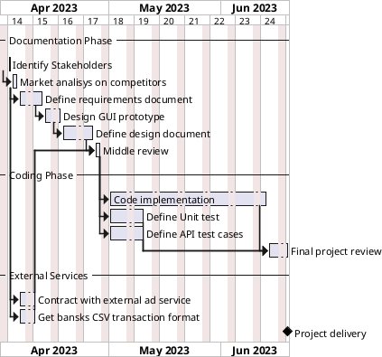

# Project Estimation - FUTURE

Date: 2023-04-21

Version: 1.0

# Estimation approach

Consider the EZWallet project in CURRENT version (as received by the teachers), assume that you are going to develop the project INDEPENDENT of the deadlines of the course

# Estimate by size

###

|                                                                                                         | Estimate |
| ------------------------------------------------------------------------------------------------------- | -------- |
| NC = Estimated number of modules to be developed                                                        | 30       |
| A = Estimated average size per class, in LOC                                                            | 400      |
| S = Estimated size of project, in LOC (= NC \* A)                                                       | 12000    |
| E = Estimated effort, in person hours (here use productivity 10 LOC per person hour)                    | 1200ph   |
| C = Estimated cost, in euro (here use 1 person hour cost = 30 euro)                                     | 36000€   |
| Estimated calendar time, in calendar weeks (Assume team of 4 people, 8 hours per day, 5 days per week ) | 8 weeks  |

# Estimate by product decomposition

###

| component name       | Estimated effort (person hours) |
| -------------------- | ------------------------------- |
| requirement document | 150 ph                          |
| GUI prototype        | 80 ph                          |
| design document      | 200 ph                          |
| code                 | 1000 ph                         |
| unit tests           | 250 ph                          |
| api tests            | 250 ph                          |
| management documents | 80 ph                           |

# Estimate by activity decomposition

###

| Activity name                     | Estimated effort (person hours) |
| --------------------------------- | ------------------------------- |
| Identify Stakeholders             | 10ph                            |
| Market analisys on competitors    | 40ph                            |
| Define requirements document      | 150ph                           |
| Contract with external ad service | 100ph                           |
| Get banks CSV transaction formats | 100ph                           |
| Middle review                     | 40ph                            |
| Design GUI prototype              | 80ph                            |
| Define design document            | 200ph                           |
| Code implementation               | 1000ph                          |
| Define Unit test                  | 250ph                           |
| Define API test cases             | 250ph                           |
| Final project review              | 100ph                           |

###

Insert here Gantt chart with above activities

# Summary

Report here the results of the three estimation approaches. The estimates may differ. Discuss here the possible reasons for the difference

|                                    | Estimated effort | Estimated duration |
| ---------------------------------- | ---------------- | ------------------ |
| estimate by size                   | 1200 ph          | 8 weeks            |
| estimate by product decomposition  | 2010 ph          | 13 week            |
| estimate by activity decomposition | 2320 ph          | 15 weeks           |

The estimation by size is lower than the others, since it take into account only hours spent on writing effective code, and not other activities such as definig the requirements document or collecting the banks CSV formats.
