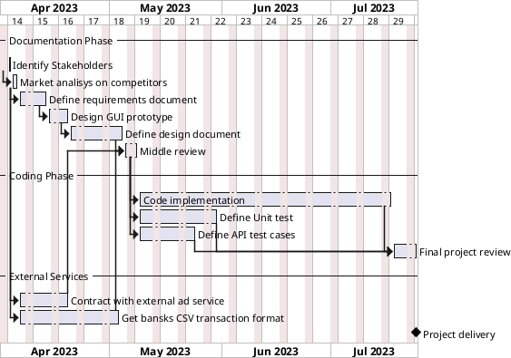

# Project Estimation - FUTURE

Date: 2023-04-21

Version: 1.0

# Estimation approach

Consider the EZWallet project in CURRENT version (as received by the teachers), assume that you are going to develop the project INDEPENDENT of the deadlines of the course

# Estimate by size

###

|                                                                                                         | Estimate |
| ------------------------------------------------------------------------------------------------------- | -------- |
| NC = Estimated number of modules to be developed                                                        | 50       |
| A = Estimated average size per class, in LOC                                                            | 600      |
| S = Estimated size of project, in LOC (= NC \* A)                                                       | 30000    |
| E = Estimated effort, in person hours (here use productivity 10 LOC per person hour)                    | 3000ph   |
| C = Estimated cost, in euro (here use 1 person hour cost = 30 euro)                                     | 90000€   |
| Estimated calendar time, in calendar weeks (Assume team of 4 people, 8 hours per day, 5 days per week ) | 19 week  |

# Estimate by product decomposition

###

| component name       | Estimated effort (person hours) |
| -------------------- | ------------------------------- |
| requirement document | 200 ph                          |
| GUI prototype        | 100 ph                          |
| design document      | 350 ph                          |
| code                 | 1600 ph                         |
| unit tests           | 500 ph                          |
| api tests            | 400 ph                          |
| management documents | 80 ph                           |

# Estimate by activity decomposition

###

| Activity name                     | Estimated effort (person hours) |
| --------------------------------- | ------------------------------- |
| Identify Stakeholders             | 10ph                            |
| Market analisys on competitors    | 40ph                            |
| Define requirements document      | 200ph                           |
| Contract with external ad service | 300ph                           |
| Get bansks CSV transaction format | 600ph                           |
| Middle review                     | 40ph                            |
| Design GUI prototype              | 100ph                           |
| Define design document            | 350ph                           |
| Code implementation               | 1600ph                          |
| Define Unit test                  | 500ph                           |
| Define API test cases             | 400ph                           |
| Final project review              | 150ph                           |

###

Insert here Gantt chart with above activities

# Summary

Report here the results of the three estimation approaches. The estimates may differ. Discuss here the possible reasons for the difference

|                                    | Estimated effort | Estimated duration |
| ---------------------------------- | ---------------- | ------------------ |
| estimate by size                   | 3000 ph          | 18 week            |
| estimate by product decomposition  | 3230 ph          | 20 week            |
| estimate by activity decomposition | 4290 ph          | 17 weeks           |
