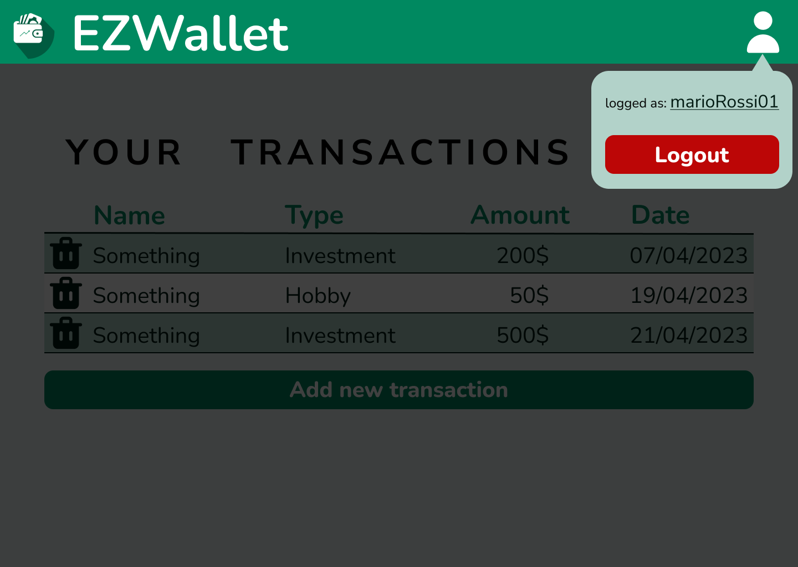

# Graphical User Interface Prototype  - CURRENT

Authors:

Date: 2023-04-27

Version:

\<Report here the GUI that you propose for EZWallet in CURRENT form, as received by teachers. You are free to organize it as you prefer. A suggested presentation matches the Use cases and scenarios defined in the Requirement document. The GUI can be shown as a sequence of graphical files (jpg, png)  >
# Contents
- [Graphical User Interface Prototype  - CURRENT](#graphical-user-interface-prototype----current)
- [Contents](#contents)
- [Website home page](#website-home-page)
- [Manage user](#manage-user)
  - [Registration (UC4)](#registration-uc4)
  - [Login (UC5)](#login-uc5)
  - [User profile page (UC10)](#user-profile-page-uc10)
  - [Logout (UC6)](#logout-uc6)
- [Manage transactions](#manage-transactions)
  - [Show transactions (UC3)](#show-transactions-uc3)
  - [Add transaction (UC1)](#add-transaction-uc1)
  - [Delete transaction (UC2)](#delete-transaction-uc2)
- [Manage categories](#manage-categories)
  - [Show categories (UC8)](#show-categories-uc8)
  - [Add category (UC7)](#add-category-uc7)

# Website home page

# Manage user
## Registration (UC4)
.png)
*Scenario 4.1: nominal case*

.png)
*Scenario 4.2: exception*

## Login (UC5)
.png)
*Scenario 5.1: nominal case*

.png)
*Scenario 5.2: exception*

## User profile page (UC10)

## Logout (UC6)

# Manage transactions
## Show transactions (UC3)
.png)
*Scenario 3.1: nominal case*

.png)
*Scenario 3.2: exception*

*Scenario 3.3: variant labelled transactions*

## Add transaction (UC1)

## Delete transaction (UC2)

# Manage categories
## Show categories (UC8)

*Scenario 8.1: nominal case*

.png)
*Scenario 8.2: exception*

## Add category (UC7)

