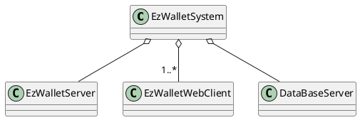
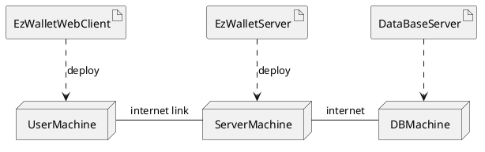

# Requirements Document - current EZWallet

Date: 

Version: V1 - description of EZWallet in CURRENT form (as received by teachers)

 
| Version number | Change |
| ----------------- |:-----------|
| | | 

# Contents

- [Requirements Document - current EZWallet](#requirements-document---current-ezwallet)
- [Contents](#contents)
- [Informal description](#informal-description)
- [Stakeholders](#stakeholders)
- [Context Diagram and interfaces](#context-diagram-and-interfaces)
	- [Context Diagram](#context-diagram)
	- [Interfaces](#interfaces)
- [Stories and personas](#stories-and-personas)
		- [Persona1:](#persona1)
		- [Persona2:](#persona2)
- [Functional and non functional requirements](#functional-and-non-functional-requirements)
	- [Functional Requirements](#functional-requirements)
	- [Non Functional Requirements](#non-functional-requirements)
- [Use case diagram and use cases](#use-case-diagram-and-use-cases)
	- [Use case diagram](#use-case-diagram)
		- [Add transaction, UC1](#add-transaction-uc1)
				- [Scenario 1.1](#scenario-11)
		- [Delete transaction, UC2](#delete-transaction-uc2)
				- [Scenario 2.1](#scenario-21)
				- [Scenario 2.2](#scenario-22)
		- [Show transactions, UC3](#show-transactions-uc3)
				- [Scenario 3.1](#scenario-31)
				- [Scenario 3.2](#scenario-32)
				- [Scenario 3.3](#scenario-33)
		- [User Registration, UC4](#user-registration-uc4)
				- [Scenario 4.1](#scenario-41)
			- [Scenario 4.2](#scenario-42)
		- [User Login, UC5](#user-login-uc5)
				- [Scenario 5.1](#scenario-51)
				- [Scenario 5.2](#scenario-52)
		- [User Logout, UC6](#user-logout-uc6)
				- [Scenario 6.1](#scenario-61)
		- [Add category, UC7](#add-category-uc7)
				- [Scenario 7.1](#scenario-71)
		- [Show categories, UC8](#show-categories-uc8)
				- [Scenario 8.1](#scenario-81)
				- [Scenario 8.2](#scenario-82)
		- [Show users, UC9](#show-users-uc9)
				- [Scenario 9.1](#scenario-91)
		- [Filter user by username, UC10](#filter-user-by-username-uc10)
				- [Scenario 10.1](#scenario-101)
				- [Scenario 10.2](#scenario-102)
				- [Scenario 10.3](#scenario-103)
- [Glossary](#glossary)
- [System Design](#system-design)
- [Deployment Diagram](#deployment-diagram)

# Informal description
EZWallet (read EaSy Wallet) is a software application designed to help individuals and families keep track of their expenses. Users can enter and categorize their expenses, allowing them to quickly see where their money is going. EZWallet is a powerful tool for those looking to take control of their finances and make informed decisions about their spending.

# Stakeholders

| Stakeholder name  | Description | 
| ----------------- |:-----------:|
|Users|Individuals and families| 
|Developers|Testers and programmers|
|CEO|Head of the startup company|
|Competitors|Satispay/Postepay (functionality that tracks expenses)|
|??DB admin??||
|Admin|User with special privileges|
|COO|Manages analytics and market analyis|

# Context Diagram and interfaces

## Context Diagram
\<Define here Context diagram using UML use case diagram>

\<actors are a subset of stakeholders>

## Interfaces
\<describe here each interface in the context diagram>

\<GUIs will be described graphically in a separate document>

| Actor | Logical Interface | Physical Interface  |
| ------------- |:-------------:| -----:|
|User|GUI (to be defined)|Keyboard, Screen|

# Stories and personas
\<A Persona is a realistic impersonation of an actor. Define here a few personas and describe in plain text how a persona interacts with the system>

\<Persona is-an-instance-of actor>

\<stories will be formalized later as scenarios in use cases>
## Persona1
Persona1: male, middle-age, low income, father, married with children 																					

Persona1, work day: wake up, breakfast, drive children to school, return home for smart working 

Persona1, week end day: wake up, prepare breakfast for family, go out with its family, hang out with friends at night 
### Story
He finds out he is spending too much money than expected, need an easy to use app to keep track of his expenses, in order to be able to maintain his family and keep on having fun with his hobbies.

## Persona2
Persona2: female, young, just graduated, high income, no children, no husband.

### Story
Finds herself with a high income just after graduation, needs a way to manage the great unexpected amount of money she is gaining.

# Functional and non functional requirements

## Functional Requirements

\<In the form DO SOMETHING, or VERB NOUN, describe high level capabilities of the system>

\<they match to high level use cases>

| ID        | Description  |
| ------------- |:-------------:| 
|FR1|Manage user account|
|FR1.1|Login|
|FR1.2|Logout|
|FR1.3|Authorize|
|FR1.4|Register (name, email, pwd)|
|FR1.5|Show registered users|
|FR1.5.1|Filter by username|
|FR2|Manage categories|
|FR2.1|Add category|
|FR2.2|Show categories|
|FR3|Manage transactions|
|FR3.1|Add transaction|
|FR3.2|Delete transaction|
|FR3.3|Show transactions|
|FR3.4|Show labelled transactions|

## Non Functional Requirements

\<Describe constraints on functional requirements>

| ID        | Type (efficiency, reliability, ..)           | Description  | Refers to |
| ------------- |:-------------:| :-----:| -----:|
|NFR1|Usability|Should be used with no training by users with at least 6 months experience with computers|FR1,FR2,FR3|
|NFR2|Efficiency|Response time lower than 100ms in optimal condition|FR1,FR2,FR3|
|NFR3|Availability|Available for the 99.999% in a year|FR1,FR2,FR3|
|NFR4|Reliability|Less than 4 minor/medium defects per month. Less than 1 severe defect per year. 0 killer defects per year|FR1,FR2,FR3|
|NFR5|Security|GDPR. Legislative requirements of the country in which the application will be used. Only authorized users can access|FR1,FR2,FR3|

# Use case diagram and use cases

## Use case diagram
\<define here UML Use case diagram UCD summarizing all use cases, and their relationships>

\<next describe here each use case in the UCD>
### Add transaction, UC1
| Actors Involved        |User|
| ------------- |:-------------:| 
|  Precondition     |User is logged in|
|  Post condition     |Transaction is added|
|  Nominal Scenario     |User adds a new transaction|
|  Variants     ||
|  Exceptions     ||

##### Scenario 1.1 

| Scenario 1.1 |Add transaction (nominal)|
| ------------- |:-------------:| 
|  Precondition     | User is logged in |
|  Post condition     | New transaction is added |
| Step#        | Description  |
|1|User creates new transaction with certain attributes|  
|2|System adds new transaction |

### Delete transaction, UC2
| Actors Involved        |User|
| ------------- |:-------------:| 
|  Precondition     |User is logged in|
|  Post condition     |Transaction is deleted|
|  Nominal Scenario     |User deletes an existing transaction|
|  Variants     ||
|  Exceptions     |User deletes a non-existing transaction|

##### Scenario 2.1 

| Scenario 2.1 |Delete transaction (nominal)|
| ------------- |:-------------:| 
|  Precondition     |User is logged in|
|  Post condition     |Transaction is deleted|
| Step#        | Description  |
|1|User deletes an existing transaction|  
|2|System deletes the transaction decided by the user|

##### Scenario 2.2 

| Scenario 2.2 |Delete transaction (exception)|
| ------------- |:-------------:| 
|  Precondition     |User is logged in|
|  Post condition     |Transaction is deleted|
| Step#        | Description  |
|1|User deletes a non existing transaction|  
|2|System does not delete anything|

### Show transactions, UC3
| Actors Involved        |User|
| ------------- |:-------------:| 
|  Precondition     |User is logged in|
|  Post condition     |Transactions are shown to the user|
|  Nominal Scenario     |Transactions are showed to the user|
|  Variants     |Labelled transactions are showed to the user|
|  Exceptions     |There are no transactions inserted yet|

##### Scenario 3.1 

| Scenario 3.1 |Show transactions (nominal)|
| ------------- |:-------------:| 
|  Precondition     |User is logged in|
|  Post condition     |Transaction are showed to the user|
| Step#        | Description  |
|1|User asks the system to show the transactions|  
|2|System retrieves and shows the transactions to the user|

##### Scenario 3.2

| Scenario 3.2 |Show transactions (exception1)|
| ------------- |:-------------:| 
|  Precondition     |User is logged in, no transactions inserted yet|
|  Post condition     |Empty list of transaction if showed to the user|
| Step#        | Description  |
|1|User asks the system to show the transactions|  
|2|System shows an empty list of transactions to the user|

##### Scenario 3.3

| Scenario 3.3 |Show transactions (variant1)|
| ------------- |:-------------:| 
|  Precondition     |User is logged in|
|  Post condition     |Labelled transactions are showed to the user|
| Step#        | Description  |
|1|User asks the system to show the labelled transactions|  
|2|System retrieves and shows labelled transactions to the user|

### User Registration, UC4

| Actors Involved        |User |
| ------------- |:-------------:| 
|  Precondition     | |
|  Post condition     | User is registerd and authorized |
|  Nominal Scenario     | User wants to register to the EzWallet system |
|  Variants     | |
|  Exceptions     | A User with the same credentials exists |

##### Scenario 4.1 

| Scenario 4.1 | (Nominal) |
| ------------- |:-------------:| 
|  Precondition     | |
|  Post condition     |User is registered |
| Step#        | Description  |
|1|User goes on the EzWallet System |  
|2|Enters the registration page |
|3|System asks for his credentials |
|4|System checks if (username, password, email) are correct |
|5|User is registered |

#### Scenario 4.2

| Scenario 4.2 | (Exception) |
| ------------- |:-------------:| 
|  Precondition     |User is registered |
|  Post condition     |New User registration failed |
| Step#        | Description  |
|1|User goes on the EzWallet System |  
|2|Enters the registration page |
|3|System asks for his credentials |
|4|System checks if (username, password, email) are correct |
|5|Email is already used, an error is showed to the user|

### User Login, UC5

| Actors Involved        |User |
| ------------- |:-------------:| 
|  Precondition     | User is registered |
|  Post condition     | User is logged in and authorized |
|  Nominal Scenario     | User wants to login to the EzWallet System |
|  Variants     | |
|  Exceptions     | The login credentials are invalid |

##### Scenario 5.1 

| Scenario 5.1 | (Nominal) |
| ------------- |:-------------:| 
|  Precondition     |User is registered |
|  Post condition     | User is logged in and authorized |
| Step#        | Description  |
|1|User goes on the EzWallet System |  
|2|Enters the login page |
|3|System asks for his credentials |
|4|System checks if (username, password, email) are correct |
|5|User is logged in |

##### Scenario 5.2

| Scenario 5.2 | (Exception) |
| ------------- |:-------------:| 
|  Precondition     |User is registered or not registered |
|  Post condition     | User is not logged in |
| Step#        | Description  |
|1|User goes on the EzWallet System |  
|2|Enters the login page |
|3|System asks for his credentials |
|4|System checks if (username, password, email) are correct |
|5|System rejects User |

### User Logout, UC6

| Actors Involved        |User |
| ------------- |:-------------:| 
|  Precondition     | User is logged id and authorized |
|  Post condition     | User is logged out  |
|  Nominal Scenario     | User wants to logout fom the EzWallet System |
|  Variants     | |
|  Exceptions     | |

##### Scenario 6.1 

| Scenario 6.1 | (Nominal) |
| ------------- |:-------------:| 
|  Precondition     |User is registered |
|  Post condition     | User is logged in and authorized |
| Step#        | Description  |
|1|User goes on the EzWallet System |  
|2|User asks to logout |
|2|User is logged out |

### Add category, UC7
| Actors Involved        |User|
| ------------- |:-------------:| 
|  Precondition     | User is logged in |
|  Post condition     | Category added |
|  Nominal Scenario     | A new category is added|
|  Variants     |  |
|  Exceptions     ||

##### Scenario 7.1 

| Scenario 7.1 | Add category (nominal) |
| ------------- |:-------------:| 
|  Precondition     | User is logged in |
|  Post condition     | Category added |
| Step#        | Description  |
|  1     | User inserts category type and color |  
|  2     | System creates the new category with the specified type and color|

### Show categories, UC8
| Actors Involved        |User|
| ------------- |:-------------:| 
|  Precondition     | User has to be logged in |
|  Post condition     | List of categories |
|  Nominal Scenario     | A list with all available categories is returned |
|  Variants     |  |
|  Exceptions     | No categories inserted|

##### Scenario 8.1 

| Scenario 8.1 | Show categories (nominal) |
| ------------- |:-------------:| 
|  Precondition     | User is logged in |
|  Post condition     | List of categories |
| Step#        | Description  |
|  1     | User request the list |  
|  2     | System retrieves the list of categories|
|3|The list of categories is returned|

##### Scenario 8.2

| Scenario 8.2| Show categories (exception) |
| ------------- |:-------------:| 
|  Precondition     | User is logged in |
|  Post condition     | Empty list |
| Step#        | Description  |
|  1     | User request the list |  
|  2     | No categories are present|
|3| The system returns an empty list|

### Show users, UC9
WARNING: this use case is actually a defect of the app, since this should be an only-admin usecase, but can be done not only by normal logged users, 
but also by non logged users.

| Actors Involved        |User|
| ------------- |:-------------:| 
|  Precondition     |  |
|  Post condition     | List of registered users is showed |
|  Nominal Scenario     | A list with all registered users is returned to the user |
|  Variants     |  |
|  Exceptions     | |

##### Scenario 9.1

| Scenario 9.1| Show users (nominal) |
| ------------- |:-------------:| 
|  Precondition     | |
|  Post condition     | List of registered users is showed |
| Step#        | Description  |
|  1     | User requests the list of users|  
|  2     | System retrieves users and returns the list|

### Get info about account, UC10

| Actors Involved        |User|
| ------------- |:-------------:| 
|  Precondition     | User is logged in  |
|  Post condition     | Account info are showed |
|  Nominal Scenario     | Info of the account of the requesting user are showed |
|  Variants     |  |
|  Exceptions     ||

##### Scenario 10.1

| Scenario 10.1| Get info about account (nominal) |
| ------------- |:-------------:| 
|  Precondition     |User is logged in |
|  Post condition     | Filtered user is showed |
| Step#        | Description  |
|  1     | User asks the system information about his profile|  
|  2     | System retrieves and returns info about the profile|

# Glossary

\<use UML class diagram to define important terms, or concepts in the domain of the application, and their relationships> 

\<concepts must be used consistently all over the document, ex in use cases, requirements etc>

# System Design
\<describe here system design>

\<must be consistent with Context diagram>

# Deployment Diagram 

\<describe here deployment diagram >

<!-- CHIDERE:
  - DB admin negli stakerholder
  - Specializzazione User in Admin, COO (in Glossario)
  - Come specificare il tipo di Transaction e Category 
  - Client nel system design?
  - Table of rights?
  - Version Number?
  - Add something about defects found in the project
  - Aggiungere eccezioni dovute al fatto che server/db hanno qualche errore ?
  - Glossario, lo scrivo come penso che debba essere fatto, o come è nel codice ?
  - Add something in informal description about the app (?)

  ---DEFECTS:
  -No admin implementation
  -Transactions and categories are not tied to the users, everyone can see all transactions and categories
  -Get label does not return transaction with attached label
  -Getusers can be done also by users who are not logged in
  -Getuserbyusername works only if done on the user that is the same of the one who is performing the research
  - -->