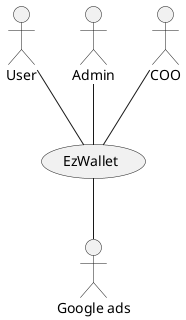
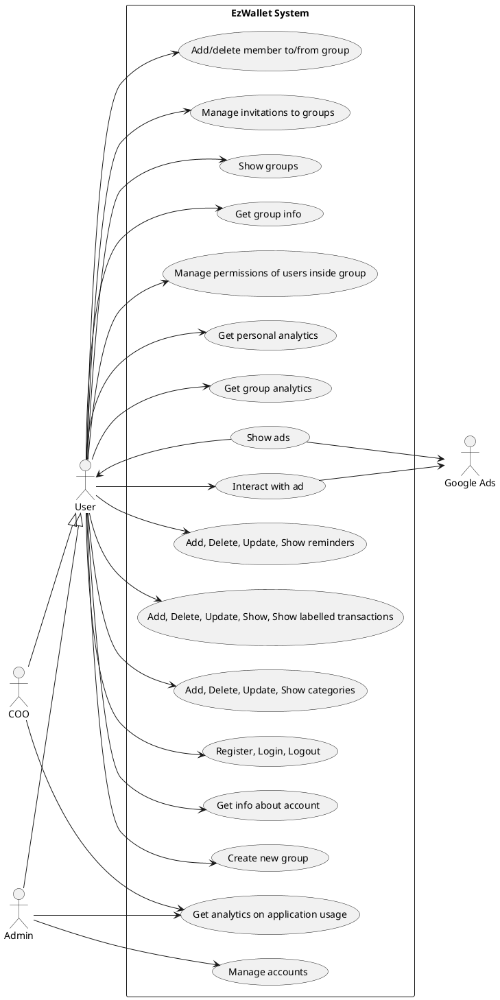
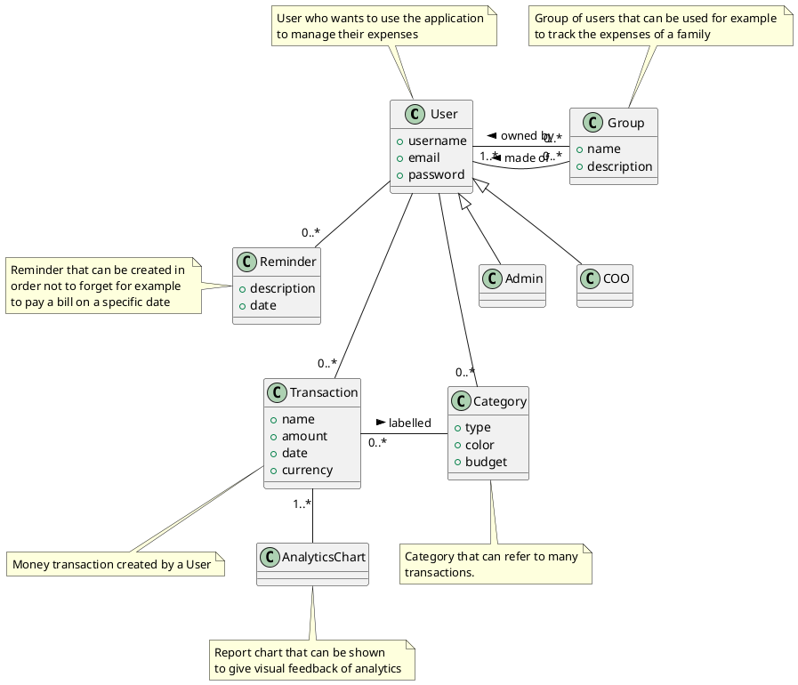
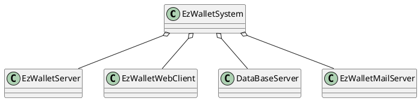
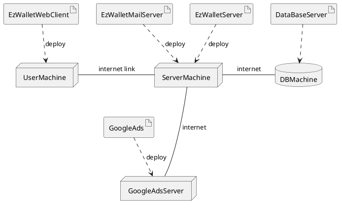

# Requirements Document - current EZWallet

Date: 2023-04-28

Version: V2 - description of EZWallet

 
| Version number | Change |
| -------------- | :----- |
|1.0|Added stakeholders, context diagram and stories and personas|
|1.1|Added interfaces|
|2.0|Added FR and NF     |
|3.0|Added Glossary, System design and Deployment diagram|
|4.0|Added use cases|
|5.0|Added use case diagram|
|6.0|Added table of rights|

# Contents

- [Requirements Document - current EZWallet](#requirements-document---current-ezwallet)
- [Contents](#contents)
- [Informal description](#informal-description)
- [Business model](#business-model)
- [Stakeholders](#stakeholders)
- [Context Diagram and interfaces](#context-diagram-and-interfaces)
	- [Context Diagram](#context-diagram)
	- [Interfaces](#interfaces)
- [Stories and personas](#stories-and-personas)
	- [Persona1](#persona1)
		- [Story](#story)
	- [Persona2](#persona2)
		- [Story](#story-1)
	- [Persona3](#persona3)
		- [Story](#story-2)
	- [Persona4](#persona4)
		- [Story](#story-3)
- [Functional and non functional requirements](#functional-and-non-functional-requirements)
	- [Functional Requirements](#functional-requirements)
	- [Table of rights](#table-of-rights)
	- [Non Functional Requirements](#non-functional-requirements)
- [Use case diagram and use cases](#use-case-diagram-and-use-cases)
	- [Use case diagram](#use-case-diagram)
		- [Add transaction, UC1](#add-transaction-uc1)
				- [Scenario 1.1](#scenario-11)
				- [Scenario 1.2](#scenario-12)
				- [Scenario 1.3](#scenario-13)
				- [Scenario 1.4](#scenario-14)
				- [Scenario 1.5](#scenario-15)
		- [Delete transaction, UC2](#delete-transaction-uc2)
				- [Scenario 2.1](#scenario-21)
		- [Show transactions, UC3](#show-transactions-uc3)
				- [Scenario 3.1](#scenario-31)
				- [Scenario 3.2](#scenario-32)
				- [Scenario 3.3](#scenario-33)
				- [Scenario 3.4](#scenario-34)
		- [Registration, UC4](#registration-uc4)
				- [Scenario 4.1](#scenario-41)
				- [Scenario 4.2](#scenario-42)
				- [Scenario 4.3](#scenario-43)
		- [Login, UC5](#login-uc5)
				- [Scenario 5.1](#scenario-51)
				- [Scenario 5.2](#scenario-52)
		- [Logout, UC6](#logout-uc6)
				- [Scenario 6.1](#scenario-61)
		- [Add category, UC7](#add-category-uc7)
				- [Scenario 7.1](#scenario-71)
		- [Show categories, UC8](#show-categories-uc8)
				- [Scenario 8.1](#scenario-81)
				- [Scenario 8.2](#scenario-82)
				- [Scenario 8.3](#scenario-83)
		- [Update category, UC9](#update-category-uc9)
				- [Scenario 9.1](#scenario-91)
		- [Get info about account, UC10](#get-info-about-account-uc10)
				- [Scenario 10.1](#scenario-101)
		- [Get Personal Analytics, UC11](#get-personal-analytics-uc11)
				- [Scenario 11.1](#scenario-111)
				- [Scenario 11.2](#scenario-112)
		- [Get group analytics, UC12](#get-group-analytics-uc12)
				- [Scenario 12.1](#scenario-121)
				- [Scenario 12.2](#scenario-122)
		- [Manage invitations to groups, UC13](#manage-invitations-to-groups-uc13)
				- [Scenario 13.1](#scenario-131)
				- [Scenario 13.2](#scenario-132)
		- [Manage permissions of users inside group, UC14](#manage-permissions-of-users-inside-group-uc14)
				- [Scenario 14.1](#scenario-141)
				- [Scenario 14.2](#scenario-142)
		- [Create new group, UC15](#create-new-group-uc15)
				- [Scenario 15.1](#scenario-151)
		- [Add new member to a group, UC16](#add-new-member-to-a-group-uc16)
				- [Scenario 16.1](#scenario-161)
				- [Scenario 16.2](#scenario-162)
				- [Scenario 16.3](#scenario-163)
		- [Delete a member from a group, UC17](#delete-a-member-from-a-group-uc17)
				- [Scenario 17.1](#scenario-171)
				- [Scenario 17.2](#scenario-172)
		- [Get group info, UC18](#get-group-info-uc18)
				- [Scenario 18.1](#scenario-181)
		- [Update transaction, UC19](#update-transaction-uc19)
				- [Scenario 19.1](#scenario-191)
		- [Delete category, UC20](#delete-category-uc20)
				- [Scenario 20.1](#scenario-201)
		- [Manage accounts, UC21](#manage-accounts-uc21)
				- [Scenario 21.1](#scenario-211)
		- [Get analytics on application usage, UC22](#get-analytics-on-application-usage-uc22)
				- [Scenario 22.1](#scenario-221)
		- [Interact with Ads, UC23](#interact-with-ads-uc23)
				- [Scenario 23.1](#scenario-231)
		- [Show Ads, UC24](#show-ads-uc24)
				- [Scenario 24.1](#scenario-241)
		- [Show groups, UC25](#show-groups-uc25)
				- [Scenario 25.1](#scenario-251)
				- [Scenario 25.2](#scenario-252)
		- [Add reminder, UC26](#add-reminder-uc26)
				- [Scenario 26.1](#scenario-261)
		- [Delete reminder, UC27](#delete-reminder-uc27)
				- [Scenario 27.1](#scenario-271)
		- [Update reminder, UC28](#update-reminder-uc28)
				- [Scenario 28.1](#scenario-281)
		- [Show reminders, UC29](#show-reminders-uc29)
				- [Scenario 29.1](#scenario-291)
				- [Scenario 29.2](#scenario-292)
- [Glossary](#glossary)
- [System Design](#system-design)
- [Deployment Diagram](#deployment-diagram)

# Informal description

EZWallet (read EaSy Wallet) is a software application designed to help individuals and families keep track of their expenses. Users can enter and categorize their expenses, allowing them to quickly see where their money is going. EZWallet is a powerful tool for those looking to take control of their finances and make informed decisions about their spending. 
EzWallet also provides an easy way to categorise different types of transactions, easy to understand expense reports. Users can also create groups (with relatives group expenses reports), which can be useful for families who want to track their spending. It also offers a simple mechanism for setting reminders for specific payments such as bills.

# Business model

Startup company developing an application. Revenue comes from ads, using an external service (google ads).

# Stakeholders

| Stakeholder name |                      Description                       |
| ---------------- | :----------------------------------------------------: |
| Users            |                Individuals and families                |
| Developers       |                Testers and programmers                 |
| CEO              |              Head of the startup company               |
| Competitors      | Satispay/Postepay (functionality that tracks expenses) |
| DB admin     	   | Person in charge of managing the database              |
| Admin            |              User with special privileges              |
| COO              |          Manages analytics and market analyis          |
|Google ads		   | 				Advertisement service					|
|AI domain expert|For importing transactions with receipt scanning|

# Context Diagram and interfaces

## Context Diagram

## Interfaces

| Actor |  Logical Interface  | Physical Interface |
| ----- | :-----------------: | -----------------: |
| User  | GUI |   Keyboard, Screen |
| Admin | GUI/Shell| Keyboard, Screen|
| COO | GUI | Keyboard, Screen|
|Google ads|API (see https://developers.google.com/google-ads/api/docs/start)|Internet|

# Stories and personas

## Persona1
Persona1: male, middle-age, low income, father, married with children 																					

Work day: wake up, breakfast, drive children to school, return home for smart working 

Week end day: wake up, prepare breakfast for family, go out with its family, hang out with friends at night 

### Story

He realises he is spending more money than he expected and needs an easy-to-use app to keep track of his spending so he can provide for his family and continue to enjoy his hobbies

## Persona2

Persona2: female, young, just graduated, high income, no children, no husband.

Work day: wakes up, breakfast, works at home, lunch, back to work until late, dinner

Week end day: wakes up late, finishes work left from the week, hangs out with friends at night

### Story

Finds herself with a high income just after graduation, needs a way to manage the great unexpected amount of money she is gaining.

## Persona3

Persona3: male, young, CEO of a startup company, medium income, no children, not married

Work day: wakes up, breakfast, goes to office, lunch, back to work until late, dinner

Week end day: wakes up early, finishes work left from the week, goes for a walk outside in the afternoon, hangs out with friends at night

### Story

He has set up his own start-up company and needs an easy way to track the expenses incurred by his employees using the corporate credit cards issued to them by the company for work-related expenses.

## Persona4

Persona4: female, 30s, mother of 1 year old child, medium-low income, married

### Story
She is the mother of a newborn child and would like to keep track of her expenses so that she can better manage her money and provide for her child's future needs.

# Functional and non functional requirements

## Functional Requirements

| ID      |         Description         |
| ------- | :-------------------------: |
| FR1     |     Manage user accounts     |
|FR1.1|CRUD user account (name, email, pwd)|
| FR1.2   |            Login            |
| FR1.3   |           Logout            |
| FR1.4   |          Authorize          |
| FR1.5   | Register (name, email, pwd) |
|FR1.5.1|Send verification code via email|
|FR1.5.2|Verify code sent via email|
| FR1.6   |   Manage access rights      |
| FR1.7   |    Show registered users    |
| FR1.7.1 |     Get info about user account      |
|FR2|Manage categories|
|FR2.1|CRUD categories|
|FR2.2|Detect when category budget has exceeded|
|FR2.3|Manage currency conversion|
|FR3| Manage transactions|
|FR3.1|CRUD transactions|
|FR3.2| Show labelled transactions|
|FR3.3|Show filtered transactions (by category, time period, amount)|
|FR3.4|Import transactions from CSV file|
|FR3.5|Import transactions from receipt scanning|
|FR3.6|Manage currency conversion|
|FR4|Analytics|
|FR4.1|Show charts about personal expenses|
|FR4.1.1|Filter by type of transaction, date, amount exchanged|
|FR4.2|Analytics on application usage|
|FR4.3|Show charts about group expenses|
|FR4.3.1|Filter by type of transaction, date, amount exchanged, users|
|FR5|Manage groups of users|
|FR5.1|Manage users rights|
|FR5.1.1|Give/Remove user's permission to see transactions of other group members|
|FR5.2|Create group|
|FR5.3|Add/remove user to group|
|FR5.3.1|Search user by username|
|FR5.4|Accept invitation to group|
|FR5.4|Show groups|
|FR5.4.1|Show group info|
|FR5.5|CRUD group description|
|FR6|Manage ads| 
|FR6.1|Interact with ads|
|FR6.2|Show ads|
|FR6.3|Receive ads|
|FR7|Manage reminders|
|FR7.1|CRUD reminders|
|FR7.2|Sends email when near the event| 

## Table of rights

| Actor | User | Admin | COO | GoogleAds |
| - | :-: | :-: | :-: | :-: |
| FR1.2/1.3/1.5/1.7.1   | x    |   x   |  x  |           |
| FR1.1/1.4/1.6/1.7 |      |   x   |     |           |
| FR2   | x    |   x   | x   |           |
| FR3   | x    |   x   | x   |           |
| FR4.1/4.3   | x    |   x   | x   |           |
| FR4.2 |      |   x   | x   |           |
| FR5   | x    |   x   | x   |           |
| FR6   | x    |   x   | x   |   x       |
| FR7   | x    |   x   | x   |          |

## Non Functional Requirements

| ID   | Type (efficiency, reliability, ..) |                                                      Description                                                      |   Refers to |
| ---- | :--------------------------------: | :-------------------------------------------------------------------------------------------------------------------: | ----------: |
| NFR1 |Usability|Should be used with no training by users with at least 6 months experience with computers|All functionalities (except for FR3.4)|
| NFR2 |Efficiency|Response time lower than 100ms in optimal condition|All functionalities|
| NFR3 |Availability|Available for the 99.999% in a year|All functionalities|
| NFR4 |Reliability|Less than 4 minor/medium defects per month. Less than 1 severe defect per year. 0 killer defects per year|All functionalities (except for F3.5)|
| NFR5 |Security|GDPR.Legislative requirements of the country in which the application will be used. Only authorized users can access.|All functionalities|
|NFR6|Maintanibility|2 person hours to add/modify/cancel a software function. 4 person hours to fix a minor/medium defect, 15 person hours to fix a severe defect|All functionalities|

# Use case diagram and use cases

## Use case diagram

<!-- 
Check the use case by making attention to this statement taken from the slides: 
The use case cares only what is the relationship of the actor to the system.
The goal must be of value to the (primary) actor:
-Enter PIN code is not
-Withdraw cash is
(Don't go in implementation details e.g. touch pinpad screen)
-->

### Add transaction, UC1
| Actors Involved  |            User             |
| ---------------- | :-------------------------: |
| Precondition     |      User is logged in      |
| Post condition   |    Transaction is added     |
| Nominal Scenario | User adds a new transaction |
| Variants         |  Add transactions from CSV, receipt scanning|
| Exceptions       |                             |

##### Scenario 1.1 

| Scenario 1.1   |              Add transaction (nominal)               |
| -------------- | :--------------------------------------------------: |
| Precondition   |                  User is logged in                   |
| Post condition |               New transaction is added               |
| Step#          |                     Description                      |
| 1              | User asks to create a new transaction with certain attributes |
| 2              |             System adds new transaction              |

##### Scenario 1.2 

| Scenario 1.2   |              Add transaction from CSV (variant)               |
| -------------- | :--------------------------------------------------: |
| Precondition   |                  User is logged in                   |
| Post condition |               List of transactions is added               |
| Step#          |                     Description                      |
| 1              | User asks to import a list of transactions from a CSV file of a certain format |
| 2              |             System adds transactions from imported CSV              |

##### Scenario 1.3 

| Scenario 1.3   |              Add transaction from CSV (variant-exception)               |
| -------------- | :--------------------------------------------------: |
| Precondition   |                  User is logged in                   |
| Post condition |               List of transactions is not added               |
| Step#          |                     Description                      |
| 1              | User asks to import a list of transactions from a CSV file of a certain format |
| 2              |             System detects that CSV format is not supported              |
|3|System tells user that CSV format is not supported|

##### Scenario 1.4 

| Scenario 1.4   |              Add transaction from receipt scanning (variant)|
| -------------- | :--------------------------------------------------: |
| Precondition   |                  User is logged in                   |
| Post condition |               Transaction is added              |
| Step#          |                     Description                      |
| 1              | User asks to import a transaction from a receipt photo|
| 2              |             System infers transaction data and asks the user if he wants to modify them|
|3|User does not modify transaction and confirms|
|4|System adds transaction|

##### Scenario 1.5 

| Scenario 1.5   |              Add transaction from receipt scanning (variant-exception)|
| -------------- | :--------------------------------------------------: |
| Precondition   |                  User is logged in                   |
| Post condition |               Transaction is not added              |
| Step#          |                     Description                      |
| 1              | User asks to import a transaction from a receipt photo|
| 2              |             System cannot infer transaction data and asks the user to insert a better photo|

### Delete transaction, UC2
| Actors Involved  |                  User                   |
| ---------------- | :-------------------------------------: |
| Precondition     |            User is logged in            |
| Post condition   |         Transaction is deleted          |
| Nominal Scenario |  User deletes an existing transaction   |
| Variants         |                                         |
| Exceptions       | User deletes a non-existing transaction |

##### Scenario 2.1 

| Scenario 2.1   |            Delete transaction (nominal)            |
| -------------- | :------------------------------------------------: |
| Precondition   |                 User is logged in                  |
| Post condition |               Transaction is deleted               |
| Step#          |                    Description                     |
| 1              |        User asks to delete an existing transaction        |
| 2              | System deletes the transaction decided by the user |

### Show transactions, UC3
| Actors Involved  |                     User                     |
| ---------------- | :------------------------------------------: |
| Precondition     |              User is logged in               |
| Post condition   |      Transactions are shown to the user      |
| Nominal Scenario |     Transactions are showed to the user      |
| Variants         | Labelled transactions are showed to the user |
|				   | Filtered transactions are showed to the user |
| Exceptions       |    There are no transactions inserted yet    |

##### Scenario 3.1 

| Scenario 3.1   |               Show transactions (nominal)               |
| -------------- | :-----------------------------------------------------: |
| Precondition   |                    User is logged in                    |
| Post condition |           Transaction are showed to the user            |
| Step#          |                       Description                       |
| 1              |      User asks the system to show the transactions      |
| 2              | System retrieves and shows the transactions to the user |

##### Scenario 3.2
| Scenario 3.2   |             Show transactions (exception1)             |
| -------------- | :----------------------------------------------------: |
| Precondition   |    User is logged in, no transactions inserted yet     |
| Post condition |    Empty list of transaction if showed to the user     |
| Step#          |                      Description                       |
| 1              |     User asks the system to show the transactions      |
| 2              | System shows an empty list of transactions to the user |

##### Scenario 3.3

| Scenario 3.3   |                 Show transactions (variant1)                 |
| -------------- | :----------------------------------------------------------: |
| Precondition   |                      User is logged in                       |
| Post condition |         Labelled transactions are showed to the user         |
| Step#          |                         Description                          |
| 1              |    User asks the system to show the labelled transactions    |
| 2              | System retrieves and shows labelled transactions to the user |

##### Scenario 3.4
| Scenario 3.4   |                 Show transactions (variant2)                    |
| -------------- | :--------------------------------------------------------------:|
| Precondition   |                      User is logged in                          |
| Post condition |         Filtered transactions are showed to the user            |
| Step#          |                         Description                             |
| 1				 | User sets up the filter (by category, time period, amount)|
| 2              |          User asks the system to show the transactions	       |
| 3              | System retrieves and shows filtered transactions to the user    |

### Registration, UC4

| Actors Involved  |                     User                      |
| ---------------- | :-------------------------------------------: |
| Precondition     |                                   |
| Post condition   |       User is registered and authorized        |
| Nominal Scenario | User registers to the EzWallet system |
| Variants         |                                               |
| Exceptions       |    A User with the same credentials exists, user inserts wrong verification code    |

##### Scenario 4.1 

| Scenario 4.1   |                        (Nominal)                         |
| -------------- | :------------------------------------------------------: |
| Precondition   |                                                          |
| Post condition |                    User is registered                    |
| Step#          |                       Description                        |
| 1              |               User asks the system to register              |
| 2              |             System asks for credentials                |
|3|User inserts credentials|
| 4              | System checks if (username, password, email) are valid |
|5|System sends verification code to user's email|
| 6              |                    User inserts verification code        |
|7|User is registered|

##### Scenario 4.2

| Scenario 4.2   |                       (Exception)                        |
| -------------- | :------------------------------------------------------: |
| Precondition   |                    User is registered                    |
| Post condition |               New User registration failed               |
| Step#          |                       Description                        |
| 1              |               User asks the system to register              |
| 2              |             System asks for his credentials			    |
|3|User inserts credentials|
| 4              | System checks if (username, password, email) are valid |
| 5              |  Email is already used, an error is showed to the user   |

##### Scenario 4.3 

| Scenario 4.3   |                        (Exception)                         |
| -------------- | :------------------------------------------------------: |
| Precondition   |                                                          |
| Post condition |                    User is registered                    |
| Step#          |                       Description                        |
| 1              |               User asks the system to register              |
| 2              |             System asks for credentials                |
|3|User inserts credentials|
| 4              | System checks if (username, password, email) are valid |
|5|System sends verification code to user's email|
| 6              |                    User inserts wrong verification code        |
|7|System asks to user to insert the verification code again|

### Login, UC5

| Actors Involved  |                    User                    |
| ---------------- | :----------------------------------------: |
| Precondition     |             User is registered             |
| Post condition   |      User is logged in and authorized      |
| Nominal Scenario | User wants to login to the EzWallet System |
| Variants         |                                            |
| Exceptions       |     The login credentials are invalid      |

##### Scenario 5.1 

| Scenario 5.1   |                        (Nominal)                         |
| -------------- | :------------------------------------------------------: |
| Precondition   |                    User is registered                    |
| Post condition |             User is logged in and authorized             |
| Step#          |                       Description                        |
|1|User asks the system to login|
| 2              |             System asks for his credentials              |
|3|User inserts his credentials|
| 4              | System checks if (username, password, email) are correct |
| 5              |                    User is logged in                     |

##### Scenario 5.2

| Scenario 5.2   |                       (Exception)                        |
| -------------- | :------------------------------------------------------: |
| Precondition   |           User is registered or not registered           |
| Post condition |                  User is not logged in                   |
| Step#          |                       Description                        |
|1|User asks the system to login|
| 2              |             System asks for his credentials              |
|3|User inserts his credentials|
| 4              | System checks if (username, password, email) are correct |
| 5              |                   System rejects User                    |

### Logout, UC6

| Actors Involved  |                     User                     |
| ---------------- | :------------------------------------------: |
| Precondition     |       User is logged id and authorized       |
| Post condition   |              User is logged out              |
| Nominal Scenario | User wants to logout fom the EzWallet System |
| Variants         |                                              |
| Exceptions       |                                              |

##### Scenario 6.1 

| Scenario 6.1   |            (Nominal)             |
| -------------- | :------------------------------: |
| Precondition   |        User is registered        |
| Post condition | User is logged in and authorized |
| Step#          |           Description            |
| 1              |       User asks to logout        |
| 2              |        User is logged out        |

### Add category, UC7
| Actors Involved  |          User           |
| ---------------- | :---------------------: |
| Precondition     |    User is logged in    |
| Post condition   |     Category added      |
| Nominal Scenario | A new category is added |
| Variants         |                         |
| Exceptions       |                         |

##### Scenario 7.1 

| Scenario 7.1   |                      Add category (nominal)                       |
| -------------- | :---------------------------------------------------------------: |
| Precondition   |                         User is logged in                         |
| Post condition |                          Category added                           |
| Step#          |                            Description                            |
| 1              |               User asks to insert a new category with certain attributes       |
| 2              | System creates the new category with the specified attributes |

### Show categories, UC8
| Actors Involved  |                       User                       |
| ---------------- | :----------------------------------------------: |
| Precondition     |             User has to be logged in             |
| Post condition   |                List of categories                |
| Nominal Scenario | A list with all available categories is returned |
| Variants         |    Categories over budget are highlighted|
| Exceptions       |              No categories inserted              |

##### Scenario 8.1 

| Scenario 8.1   |        Show categories (nominal)        |
| -------------- | :-------------------------------------: |
| Precondition   |            User is logged in            |
| Post condition |           List of categories            |
| Step#          |               Description               |
| 1              |          User request the list          |
| 2              | System retrieves the list of categories |
| 3              |   The list of categories is returned    |

##### Scenario 8.2 

| Scenario 8.2   |        Show categories (variant)        |
| -------------- | :-------------------------------------: |
| Precondition   |            User is logged in            |
| Post condition |           List of categories           |
| Step#          |               Description               |
| 1              |          User request the list          |
| 2              | System retrieves the list of categories |
| 3              |   The list of categories is returned with categories over budget highlighted  |

##### Scenario 8.3

| Scenario 8.3   |   Show categories (exception)    |
| -------------- | :------------------------------: |
| Precondition   |        User is logged in         |
| Post condition |            Empty list            |
| Step#          |           Description            |
| 1              |      User requests the list of categories     |
| 2              |    No categories are present     |
| 3              | The system returns an empty list with an error message |

### Update category, UC9

| Actors Involved        |User|
| ------------- |:-------------:| 
|  Precondition     | User is logged in  |
|  Post condition     | Category is updated |
|  Nominal Scenario     | The category's informations are updated |
|  Variants     |  |
|  Exceptions     ||

##### Scenario 9.1

| Scenario 9.1| Update category (nominal) |
| ------------- |:-------------:| 
|  Precondition     |User is logged in |
|  Post condition     | category is updated |
| Step#        | Description  |
|  1     | User asks to update a category|  
|  2     | User inserts the new category information|
|3|System updates the category's informations|

### Get info about account, UC10

| Actors Involved        |User|
| ------------- |:-------------:| 
|  Precondition     | User is logged in  |
|  Post condition     | Account info are showed |
|  Nominal Scenario     | Info of the account of the requesting user are showed |
|  Variants     |  |
|  Exceptions     ||

##### Scenario 10.1

| Scenario 10.1| Get info about account (nominal) |
| ------------- |:-------------:| 
|  Precondition     |User is logged in |
|  Post condition     | Info about the account are showed |
| Step#        | Description  |
|  1     | User asks the system information about his profile|  
|  2     | System retrieves and returns info about the profile|

###  Get Personal Analytics, UC11

| Actors Involved    | User    |
| ------------- |:-------------:|
|    Precondition    | User is logged in |
|    Post condition    | Report charts on personal expenses are shown |
|    Nominal Scenario    | Graphs and statistics of transactions are shown    |
|    Variants    | Graphs and statistics are shown based on filters |
|    Exceptions    || 

##### Scenario 11.1

| Scenario 11.1     | Show analytics of all transactions (nominal) |
| ------------      |:--------------:|
| Precondition        | User is logged in |
| Post condition    |    Graphs and statistics of all transactions are shown    |
| Step#                | Description    |
|    1                |    User asks for his/her transactions statistics    | 
|    2                |    System retrieves the information, elaborates and return them as report charts   |

##### Scenario 11.2

| Scenario 11.2     | Show analytics of filtered transactions (variant) |
| ------------         |:--------------:|
| Precondition        |     User is logged in |
| Post condition     |     Graphs and statistics of filtered transactions are shown    |
| Step#                |    Description |
|    1                | User sets up the filter (type of transactions, amount exchanged, time period) |
|    2                | User asks for his/hers transactions statistics |
|    3                | System retrieves the information, filters, elaborates and return them as charts|

### Get group analytics, UC12
| Actors Involved    | User    |
| ------------- |:-------------:|
|    Precondition    | User is logged in, user is owner of group A | 
|    Post condition    | Charts report on group A expenses are shown |
|    Nominal Scenario    | Graphs and statistics of all transactions are shown    |
|    Variants    | Graphs and statistics are shown based on filters |
|    Exceptions    || 
##### Scenario 12.1

| Scenario 12.1     | Show analytics of all transactions (nominal) |
| ------------      |:--------------:|
| Precondition        | User is logged in, user is owner of group A |
| Post condition    |    Graphs and statistics of all transactions of group A are shown    |
| Step#                | Description    |
|    1                |    User asks for group A transactions statistics    | 
|    2                |    System retrieves the information, elaborates and return them as report charts   |

##### Scenario 12.2

| Scenario 12.2     | Show analytics of filtered transactions (variant) |
| ------------         |:--------------:|
| Precondition        |     User is logged in, user is owner of group A |
| Post condition     |     Graphs and statistics of filtered transactions of group A are shown    |
| Step#                |    Description |
|    1                | User sets up the filter (type of transactions, amount exchanged, time period) |
|    2                | User asks for group A transactions statistics |
|    3                | System retrieves the information, filters, elaborates and return them as report charts|

### Manage invitations to groups, UC13

| Actors Involved        |User|
| ------------- |:-------------:| 
|  Precondition     | User is logged in, user has been added to a group  |
|  Post condition     | User becomes member of group |
|  Nominal Scenario     | User accepts to join group |
|  Variants     | User does not accept to join group |
|  Exceptions     ||

##### Scenario 13.1

| Scenario 13.1| Manage invitations to group (nominal) |
| ------------- |:-------------:| 
|  Precondition     |User is logged in, user has been added to  group C |
|  Post condition     | User becomes member of group C |
| Step#        | Description  |
|  1     | User receives invitation to group C|  
|  2     | User accepts to join group C|
|3|User is part of group C|

##### Scenario 13.2

| Scenario 13.2| Manage invitations to group (variant) |
| ------------- |:-------------:| 
|  Precondition     |User is logged in, user has been added to  group C |
|  Post condition     | User becomes member of group C |
| Step#        | Description  |
|  1     | User receives invitation to group C|  
|  2     | User declines to join group C|
|3|User is not part of group C|

### Manage permissions of users inside group, UC14

| Actors Involved   |User|
| ------------- |:-------------:| 
|  Precondition     | User is logged in and is group owner |
|  Post condition   | User of group has/hasn't the permission to see other group's users transactions |
|  Nominal Scenario | User gives/removes permission |
|  Variants         ||
|  Exceptions       | The user already has/does not have the permission |

##### Scenario 14.1

| Scenario 14.1     | User gives/removes permission (nominal) |
| ------------         |:--------------:|
| Precondition        | User is logged in and is group owner |
| Post condition     | User of group has/hasn't the permission to see other group's users transactions |
| Step#                | Description |
|    1                | User give/remove the permission to a user in the group |
|    2                | System updates the selected user permissions |

##### Scenario 14.2

| Scenario 14.1       | User gives/removes permission (exception) |
| ------------        |:--------------:|
| Precondition        | User is logged in and is group owner |
| Post condition      | Permissions are not changed |
| Step#               | Description |
|    1                | User give/remove the permission to a user in the group |
|    2                | An error is returned to the user |

### Create new group, UC15

| Actors Involved   |User|
| ------------- |:-------------:| 
|  Precondition     |    User is logged in     |
|  Post condition   |   New group is created   |
|  Nominal Scenario | User creates a new group |
|  Variants         ||
|  Exceptions       ||

##### Scenario 15.1

| Scenario 15.1| Create new group (nominal) |
| ------------- |:-------------:| 
|  Precondition     |User is logged in |
|  Post condition     | New group is created |
| Step#        | Description  |
|  1     | User asks to create a new group| 
|2|User inserts the group name| 
|  3     | A new group is created with the user as member with all rights|

### Add new member to a group, UC16

| Actors Involved        |User|
| ------------- |:-------------:| 
|  Precondition     | User is logged in  |
|  Post condition     | New member is added |
|  Nominal Scenario     | User adds a new member to the group |
|  Variants     |  |
|  Exceptions     |User doesn't have the rights; User to be added is not found|

##### Scenario 16.1

| Scenario 16.1| Add new member to a group (nominal) |
| ------------- |:-------------:| 
|  Precondition     |User is logged in |
|  Post condition     | New member is added |
| Step#        | Description  |
|  1     | User selects the group|  
|  2     | User inserts the username of the user to be added|
|3|User selects the rights to give to the new member|
|4|New member is added|

##### Scenario 16.2

| Scenario 16.2| Add new member to a group (exception1) |
| ------------- |:-------------:| 
|  Precondition     |User is logged in |
|  Post condition     | New member is not added |
| Step#        | Description  |
|  1     | User selects the group|  
|  2     | User inserts the username of the user to be added|
|3|User doesn't have the rights to add a new member|

##### Scenario 16.3

| Scenario 16.3| Add new member to a group (exception2) |
| ------------- |:-------------:| 
|  Precondition     |User is logged in |
|  Post condition     | New member is not added |
| Step#        | Description  |
|  1     | User selects the group|  
|  2     | User inserts the username of the user to be added|
|3|User to be added is not found|

### Delete a member from a group, UC17

| Actors Involved        |User|
| ------------- |:-------------:| 
|  Precondition     | User is logged in and is group owner |
|  Post condition     | Member is removed |
|  Nominal Scenario     | A member is deleted from the group |
|  Variants     |  |
|  Exceptions     |User doesn't have the rights|

##### Scenario 17.1

| Scenario 17.1| Delete a member from a group (nominal) |
| ------------- |:-------------:| 
|  Precondition     |User is logged in and is group owner |
|  Post condition     | Member is removed |
| Step#        | Description  |
|  1     | User selects the group|  
|  2     | User selects the member to be removed|
|3|Member is removed from the group|

##### Scenario 17.2

| Scenario 17.2| Delete a member from a group (exception1) |
| ------------- |:-------------:| 
|  Precondition     |User is logged in |
|  Post condition     | Member is not removed|
| Step#        | Description  |
|  1     | User selects the group|  
|  2     | User selects the member to be removed|
|3|User doesn't have the rights to remove the member|

### Get group info, UC18

| Actors Involved        |User|
| ------------- |:-------------:| 
|  Precondition     | User is logged in, user is in a group  |
|  Post condition     | |
|  Nominal Scenario     | The info about a group are showed to the user |
|  Variants     |  |
|  Exceptions     | |

##### Scenario 18.1

| Scenario 18.1| Get group info (nominal) |
| ------------- |:-------------:| 
|  Precondition     |User is logged in, user is in  group C |
|  Post condition     |  Group info are showed |
| Step#        | Description  |
|  1     | User asks the system info about group C|  
|2|Group C info are showed to the user|

### Update transaction, UC19

| Actors Involved        |User|
| ------------- |:-------------:| 
|  Precondition     | User is logged in  |
|  Post condition     | Transaction is updated |
|  Nominal Scenario     | The transaction's informations are updated |
|  Variants     |  |
|  Exceptions     ||

##### Scenario 19.1

| Scenario 19.1| Update transaction (nominal) |
| ------------- |:-------------:| 
|  Precondition     |User is logged in |
|  Post condition     | Transaction is updated |
| Step#        | Description  |
|  1     | User selects the transaction to be updated|  
|  2     | User inserts the new transaction information|
|3|System updates the transaction's informations|

### Delete category, UC20

| Actors Involved        |User|
| ------------- |:-------------:| 
|  Precondition     | User is logged in  |
|  Post condition     | Category is deleted |
|  Nominal Scenario     | User deletes a category|
|  Variants     |  |
|  Exceptions     ||

##### Scenario 20.1

| Scenario 20.1| Delete category (nominal) |
| ------------- |:-------------:| 
|  Precondition     |User is logged in |
|  Post condition     | Category is deleted |
| Step#        | Description  |
|  1     | User asks the system to delete a category|  
|  2     |System deletes the category|

### Manage accounts, UC21

| Actors Involved        |Admin|
| ------------- |:-------------:| 
|  Precondition     | Logged as admin  |
|  Post condition     | Target user account is created/deleted/updated/read |
|  Nominal Scenario     | Admin creates/deletes/updates/reads target user account|
|  Variants     |  |
|  Exceptions     ||

##### Scenario 21.1

| Scenario 21.1| Manage accounts (nominal) |
| ------------- |:-------------:| 
|  Precondition     |Logged as admin |
|  Post condition     | Target user account is created/deleted/updated/read |
| Step#        | Description  |
|  1     | User asks the system to create/delete/update/read target user account|  
|  2     |System creates/deletes/updates/reads target user account|

### Get analytics on application usage, UC22

| Actors Involved        |Admin, COO|
| ------------- |:-------------:| 
|  Precondition     | Logged as admin/COO  |
|  Post condition     | Analytics on application usage are showed |
|  Nominal Scenario     | Admin/COO gets analytics on application usage |
|  Variants     |  |
|  Exceptions     ||

##### Scenario 22.1

| Scenario 22.1| Get analytics on application usage (nominal) |
| ------------- |:-------------:| 
|  Precondition     |Logged as admin/COO |
|  Post condition     |Analytics on application usage are showed|
| Step#        | Description  |
|  1     |Admin/COO asks for analytics on application usage|  
|  2     |System retrieves and show the analytics|

### Interact with Ads, UC23

| Actors Involved        |User, Google ads|
| ------------- |:-------------:| 
|  Precondition     | User is logged in |
|  Post condition     | User is redirected to the ad website |
|  Nominal Scenario     | User interacts with the shown ad |
|  Variants     ||
|  Exceptions     ||

##### Scenario 23.1

| Scenario 23.1     | User interacts with the shown ad (nominal) |
| ------------         |:--------------:|
| Precondition        | User is logged in |
| Post condition     | User is redirected to the ad website |
| Step#                | Description |
|    1                | User browses the application page |
|    2                | System retrieves ads from Google ads |
|    3                | Ad is shown to the user |
|	 4				  | The user clicks on the ad |
|    5                | The systems redirects the user to the ad website |

### Show Ads, UC24

| Actors Involved        |User, Google ads|
| ------------- |:-------------:| 
|  Precondition     | User is logged in |
|  Post condition     | Ad is shown to the user |
|  Nominal Scenario     | Ad is shown to the user while browsing |
|  Variants     ||
|  Exceptions     ||

##### Scenario 24.1

| Scenario 24.1     | Ad is shown to the user while browsing (nominal) |
| ------------         |:--------------:|
| Precondition        | User is logged in |
| Post condition     | Ad is shown to the user |
| Step#                | Description |
|    1                | User browses the application page |
|    2                | System retrieves ads from Google ads |
|    3                | Ad is shown to the user |

### Show groups, UC25

| Actors Involved        |User|
| ------------- |:-------------:| 
|  Precondition     | User is logged in |
|  Post condition     | The groups to which the user belongs are showed |
|  Nominal Scenario     | User asks to show the groups he belongs to |
|  Variants     ||
|  Exceptions     ||

##### Scenario 25.1

| Scenario 25.1     | Show groups (nominal) |
| ------------         |:--------------:|
| Precondition        | User is logged in |
| Post condition     | The groups to which the user belongs are showed |
| Step#                | Description |
|    1                | User asks the system the groups he belongs to |
|2| Groups are showed|

##### Scenario 25.2

| Scenario 25.2     | Show groups (exception) |
| ------------         |:--------------:|
| Precondition        | User is logged in |
| Post condition     | The groups to which the user belongs are showed |
| Step#                | Description |
|    1                | User asks the system the groups he belongs to |
|2| System detects user is not member of any group|
|3| System notifies the user with an error message|

### Add reminder, UC26
| Actors Involved  |            User             |
| ---------------- | :-------------------------: |
| Precondition     |      User is logged in      |
| Post condition   |    Reminder is added     |
| Nominal Scenario | User adds a new reminder |
| Variants         |  |
| Exceptions       |                             |

##### Scenario 26.1 

| Scenario 26.1   |              Add reminder (nominal)               |
| -------------- | :--------------------------------------------------: |
| Precondition   |                  User is logged in                   |
| Post condition |               New reminder is added               |
| Step#          |                     Description                      |
| 1              | User asks to create a new reminder with certain attributes |
| 2              |             System adds new reminder              |

### Delete reminder, UC27
| Actors Involved  |            User             |
| ---------------- | :-------------------------: |
| Precondition     |      User is logged in      |
| Post condition   |    Reminder is added     |
| Nominal Scenario | User adds a new reminder |
| Variants         |  |
| Exceptions       |                             |

##### Scenario 27.1 

| Scenario 27.1   |              Delete reminder (nominal)               |
| -------------- | :--------------------------------------------------: |
| Precondition   |                  User is logged in                   |
| Post condition |               Reminder is deleted               |
| Step#          |                     Description                      |
| 1              | User asks to delete a reminder with certain attributes |
| 2              |             System deletes reminder              |

### Update reminder, UC28
| Actors Involved  |            User             |
| ---------------- | :-------------------------: |
| Precondition     |      User is logged in      |
| Post condition   |    Reminder is updated     |
| Nominal Scenario | User updates reminder |
| Variants         |  |
| Exceptions       |                             |

##### Scenario 28.1 

| Scenario 28.1   |              Delete reminder (nominal)               |
| -------------- | :--------------------------------------------------: |
| Precondition   |                  User is logged in                   |
| Post condition |               Reminder is updated               |
| Step#          |                     Description                      |
| 1              | User asks to update a reminder with certain attributes |
| 2              |             System updates reminder              |

### Show reminders, UC29
| Actors Involved  |                     User                     |
| ---------------- | :------------------------------------------: |
| Precondition     |              User is logged in               |
| Post condition   |      Reminders are shown to the user      |
| Nominal Scenario |     Reminders are showed to the user      |
| Variants         |  |
| Exceptions       |    There are no reminders inserted yet    |

##### Scenario 29.1 

| Scenario 29.1   |               Show reminders (nominal)               |
| -------------- | :-----------------------------------------------------: |
| Precondition   |                    User is logged in                    |
| Post condition |           Reminders are showed to the user            |
| Step#          |                       Description                       |
| 1              |      User asks the system to show the reminders      |
| 2              | System retrieves and shows the reminders to the user |

##### Scenario 29.2
| Scenario 29.2   |             Show reminders (exception1)             |
| -------------- | :----------------------------------------------------: |
| Precondition   |    User is logged in, no reminders inserted yet     |
| Post condition |    Empty list of reminders is showed to the user     |
| Step#          |                      Description                       |
| 1              |     User asks the system to show the reminders      |
| 2              | System shows an empty list of reminders to the user |

# Glossary

# System Design

# Deployment Diagram 

