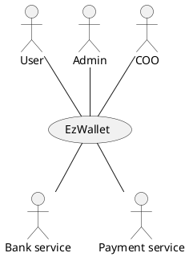
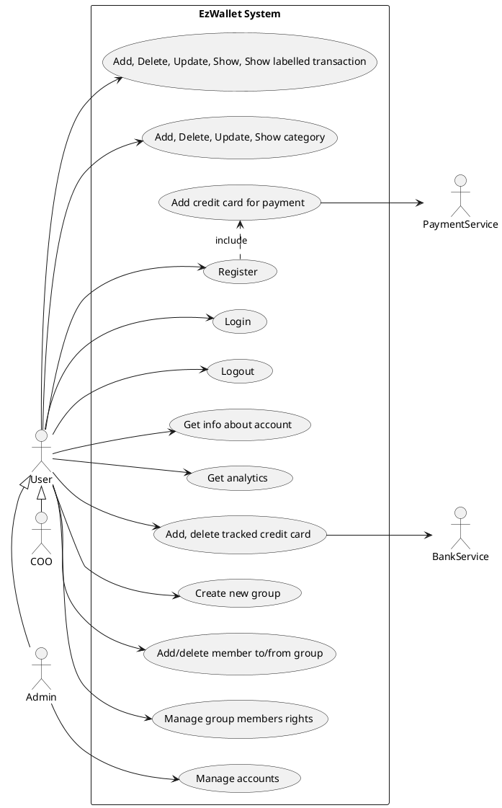
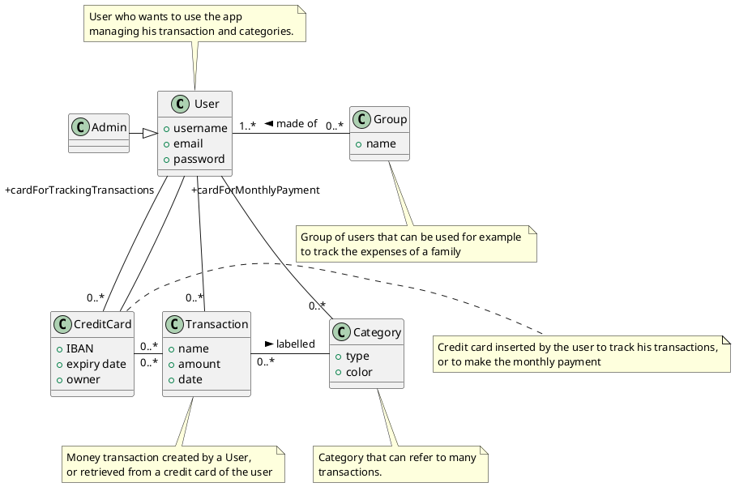
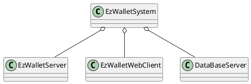
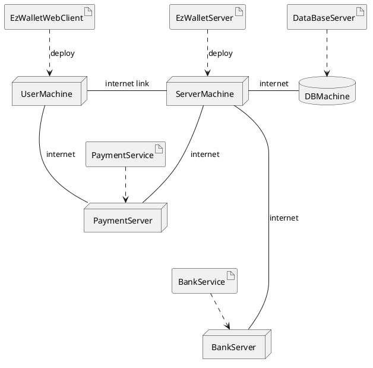

# Requirements Document - current EZWallet

Date: 

Version: V1 - description of EZWallet in CURRENT form (as received by teachers)

 
| Version number | Change |
| -------------- | :----- |
|                |        |

# Contents

- [Requirements Document - current EZWallet](#requirements-document---current-ezwallet)
- [Contents](#contents)
- [Informal description](#informal-description)
- [Business model](#business-model)
- [Stakeholders](#stakeholders)
- [Context Diagram and interfaces](#context-diagram-and-interfaces)
	- [Context Diagram](#context-diagram)
	- [Interfaces](#interfaces)
- [Stories and personas](#stories-and-personas)
	- [Persona1](#persona1)
		- [Story](#story)
	- [Persona2](#persona2)
		- [Story](#story-1)
	- [Persona3](#persona3)
		- [Story](#story-2)
- [Functional and non functional requirements](#functional-and-non-functional-requirements)
	- [Functional Requirements](#functional-requirements)
	- [Non Functional Requirements](#non-functional-requirements)
- [Use case diagram and use cases](#use-case-diagram-and-use-cases)
	- [Use case diagram](#use-case-diagram)
		- [Add transaction, UC1](#add-transaction-uc1)
				- [Scenario 1.1](#scenario-11)
		- [Delete transaction, UC2](#delete-transaction-uc2)
				- [Scenario 2.1](#scenario-21)
				- [Scenario 2.2](#scenario-22)
		- [Show transactions, UC3](#show-transactions-uc3)
				- [Scenario 3.1](#scenario-31)
				- [Scenario 3.2](#scenario-32)
				- [Scenario 3.3](#scenario-33)
		- [Registration, UC4](#registration-uc4)
				- [Scenario 4.1](#scenario-41)
				- [Scenario 4.2](#scenario-42)
		- [Login, UC5](#login-uc5)
				- [Scenario 5.1](#scenario-51)
				- [Scenario 5.2](#scenario-52)
		- [Logout, UC6](#logout-uc6)
				- [Scenario 6.1](#scenario-61)
		- [Add category, UC7](#add-category-uc7)
				- [Scenario 7.1](#scenario-71)
		- [Show categories, UC8](#show-categories-uc8)
				- [Scenario 8.1](#scenario-81)
				- [Scenario 8.2](#scenario-82)
		- [Show users, UC9](#show-users-uc9)
				- [Scenario 9.1](#scenario-91)
		- [Get info about account, UC10](#get-info-about-account-uc10)
				- [Scenario 10.1](#scenario-101)
		- [Show Analytics, UC11](#show-analytics-uc11)
				- [Scenario 11.1](#scenario-111)
				- [Scenario 11.2](#scenario-112)
		- [Add tracked credit card, UC12](#add-tracked-credit-card-uc12)
				- [Scenario 12.1](#scenario-121)
				- [Scenario 12.2](#scenario-122)
		- [Delete tracked credit card, UC13](#delete-tracked-credit-card-uc13)
				- [Scenario 13.1](#scenario-131)
		- [Add credit card for payment, UC14](#add-credit-card-for-payment-uc14)
				- [Scenario 14.1](#scenario-141)
				- [Scenario 14.2](#scenario-142)
		- [Create new group, UC15](#create-new-group-uc15)
				- [Scenario 15.1](#scenario-151)
		- [Add new member to a group, UC16](#add-new-member-to-a-group-uc16)
				- [Scenario 16.1](#scenario-161)
				- [Scenario 16.2](#scenario-162)
				- [Scenario 16.3](#scenario-163)
		- [Delete a member from a group, UC17](#delete-a-member-from-a-group-uc17)
				- [Scenario 17.1](#scenario-171)
				- [Scenario 17.2](#scenario-172)
		- [Manage group members rights, UC18](#manage-group-members-rights-uc18)
				- [Scenario 18.1](#scenario-181)
				- [Scenario 18.2](#scenario-182)
		- [Update transaction, UC19](#update-transaction-uc19)
				- [Scenario 19.1](#scenario-191)
		- [Delete category, UC20](#delete-category-uc20)
				- [Scenario 20.1](#scenario-201)
				- [Sceanrio 20.2](#scenario-202)
		- [Manage accounts, UC21](#manage-accounts-uc21)
				- [Scenario 21.1](#scenario-211)
- [Glossary](#glossary)
- [System Design](#system-design)
- [Deployment Diagram](#deployment-diagram)

# Informal description
EZWallet (read EaSy Wallet) is a software application designed to help individuals and families keep track of their expenses. Users can enter and categorize their expenses, allowing them to quickly see where their money is going. EZWallet is a powerful tool for those looking to take control of their finances and make informed decisions about their spending. 
EzWallet allows people also to attach credit cards to their account in order to automatically track transactions coming from them. EzWallet offers also an easy way to categorize different types of transactions and easily understandable analytics on expenses. Users can also create groups, this could be useful for families that need to track their expenses, or for companies to track employees' transactions made with company credit card.

<!--REMEMBER TO ADD SOMETHING -->
# Business model
Startup company developing an application. Money gain comes from subscribed users that pay a monthly fee to use the service.
<!-- CHECK if it fits -->
The subscription is automatically renewed until the user decides to cancel it. If the payment fails the account is automatically disabled and the user can no longer use the service until the fee is paid.

# Stakeholders

| Stakeholder name |                      Description                       |
| ---------------- | :----------------------------------------------------: |
| Users            |                Individuals and families                |
| Developers       |                Testers and programmers                 |
| CEO              |              Head of the startup company               |
| Competitors      | Satispay/Postepay (functionality that tracks expenses) |
| DB admin     	   | Person in charge of managing the database              |
| Admin            |              User with special privileges              |
| COO              |          Manages analytics and market analyis          |
| Bank service            | Contract to obtain access to users credit card transactions|
|Payment service| Service to manage users' monthly payment|

# Context Diagram and interfaces

## Context Diagram
\<Define here Context diagram using UML use case diagram>

\<actors are a subset of stakeholders>

## Interfaces
\<describe here each interface in the context diagram>

\<GUIs will be described graphically in a separate document>

| Actor |  Logical Interface  | Physical Interface |
| ----- | :-----------------: | -----------------: |
| User  | GUI |   Keyboard, Screen |
| Admin | GUI/Shell| Keyboard, Screen|
| COO | GUI | Keyboard, Screen|
| Bank service| API | Internet |
|Payment service|API|Internet|

# Stories and personas
\<A Persona is a realistic impersonation of an actor. Define here a few personas and describe in plain text how a persona interacts with the system>

\<Persona is-an-instance-of actor>

\<stories will be formalized later as scenarios in use cases>
## Persona1
Persona1: male, middle-age, low income, father, married with children 																					

Persona1, work day: wake up, breakfast, drive children to school, return home for smart working 

Persona1, week end day: wake up, prepare breakfast for family, go out with its family, hang out with friends at night 
### Story
He finds out he is spending too much money than expected, need an easy to use app to keep track of his expenses, in order to be able to maintain his family and keep on having fun with his hobbies.

## Persona2
Persona2: female, young, just graduated, high income, no children, no husband.

### Story
Finds herself with a high income just after graduation, needs a way to manage the great unexpected amount of money she is gaining.

<!-- CHECK: è un caso un po' marginale visto che gli anziani e la tecnologia non vanno molto d'accordo :/ -->
## Persona3
Persona3: male, old, retired, low income, children and grandchildren, married

Persona3: day: wake up, breakfast, read newspaper, walk to a bar, head back home 

### Story
He does not spend many money on himself but he likes to help his children and to make presents to his grandchildren on special occasions. Due to his low pension he needs to keep track of his expenses.
His low expertise with technology does not allow him to use services that are too complex.

## Persona4
Persona4: male, young, CEO of a startup company, medium income, no children, not married
### Story
He started his own startup company and he needs an easy way to track expenses made by his employees using che credit card given them by the company for work-related expenses.
# Functional and non functional requirements

## Functional Requirements

\<In the form DO SOMETHING, or VERB NOUN, describe high level capabilities of the system>

\<they match to high level use cases>

| ID      |         Description         |
| ------- | :-------------------------: |
| FR1     |     Manage user account     |
|FR1.1|CRUD user account (name, email, pwd)|
| FR1.2   |            Login            |
| FR1.3   |           Logout            |
| FR1.4   |          Authorize          |
| FR1.5   | Register (name, email, pwd) |
| FR1.6   |   Manage access rights      |
| FR1.7   |    Show registered users    |
| FR1.7.1 |     Get info about user account      |
|FR1.8|Disable account when monthly payment fails|
|FR2|CRUD categories|
|FR3| Manage transactions|
|FR3.1|CRUD transactions|
|FR3.2| Show labelled transactions|
|FR3.3|Show filtered transactions (by category, time period, amount,...)|
|FR4|Manage tracked credit cards|
|FR4.1|Add/remove credit card details|
|FR4.2|Get credit card transactions|
|FR4.3|Verify credit card credentials|
|FR5|Analytics|
|FR5.1|Show charts about expenses|
|FR5.1.1|Filter by card, type of transaction, date|
|FR6|Manage groups of users|
|FR6.1|Manage users rights|
|FR6.1.1|Show/Hide other users' transactions|
|FR6.2|Create group|
|FR6.3|Add/remove user to group|
|FR7|Manage payment of monthly fee|
|FR7.1|Add card for monthly payment|
|FR7.2|Receive monthly payment|
|FR7.3|Notify user when monthly subscription is near to the renewal|
<!--Think about adding functionalities proper only of Admin and COO, then consider also adding some use cases about them!-->

## Non Functional Requirements
\<Describe constraints on functional requirements>
<!--Maybe missing something about security, since we added some functionalities about credit card transactions -->
| ID   | Type (efficiency, reliability, ..) |                                                      Description                                                      |   Refers to |
| ---- | :--------------------------------: | :-------------------------------------------------------------------------------------------------------------------: | ----------: |
| NFR1 |Usability|Should be used with no training by users with at least 6 months experience with computers|FR1,FR2,FR3,FR4,FR5,FR6,FR7.1|
| NFR2 |Efficiency|Response time lower than 100ms in optimal condition|All functionalities|
| NFR3 |Availability|Available for the 99.999% in a year|All functionalities|
| NFR4 |Reliability|Less than 4 minor/medium defects per month. Less than 1 severe defect per year. 0 killer defects per year|All functionalities|
| NFR5 |Security|GDPR.Legislative requirements of the country in which the application will be used. Only authorized users can access|FR1,FR2,FR3,FR4,FR7|

# Use case diagram and use cases

## Use case diagram
\<define here UML Use case diagram UCD summarizing all use cases, and their relationships>
<!--Maybe we could format it better-->

<!-- 
Check the use case by making attention to this statement taken from the slides: 
The use case cares only what is the relationship of the actor to the system.
The goal must be of value to the (primary) actor:
-Enter PIN code is not
-Withdraw cash is
(Don't go in implementation details e.g. touch pinpad screen)
-->

\<next describe here each use case in the UCD>
### Add transaction, UC1
| Actors Involved  |            User             |
| ---------------- | :-------------------------: |
| Precondition     |      User is logged in      |
| Post condition   |    Transaction is added     |
| Nominal Scenario | User adds a new transaction |
| Variants         |                             |
| Exceptions       |                             |

##### Scenario 1.1 

| Scenario 1.1   |              Add transaction (nominal)               |
| -------------- | :--------------------------------------------------: |
| Precondition   |                  User is logged in                   |
| Post condition |               New transaction is added               |
| Step#          |                     Description                      |
| 1              | User creates new transaction with certain attributes |
| 2              |             System adds new transaction              |

### Delete transaction, UC2
| Actors Involved  |                  User                   |
| ---------------- | :-------------------------------------: |
| Precondition     |            User is logged in            |
| Post condition   |         Transaction is deleted          |
| Nominal Scenario |  User deletes an existing transaction   |
| Variants         |                                         |
| Exceptions       | User deletes a non-existing transaction |

##### Scenario 2.1 

| Scenario 2.1   |            Delete transaction (nominal)            |
| -------------- | :------------------------------------------------: |
| Precondition   |                 User is logged in                  |
| Post condition |               Transaction is deleted               |
| Step#          |                    Description                     |
| 1              |        User deletes an existing transaction        |
| 2              | System deletes the transaction decided by the user |

##### Scenario 2.2 

| Scenario 2.2   |     Delete transaction (exception)      |
| -------------- | :-------------------------------------: |
| Precondition   |            User is logged in            |
| Post condition |         Transaction is deleted          |
| Step#          |               Description               |
| 1              | User deletes a non existing transaction |
| 2              |     System does not delete anything     |

### Show transactions, UC3
| Actors Involved  |                     User                     |
| ---------------- | :------------------------------------------: |
| Precondition     |              User is logged in               |
| Post condition   |      Transactions are shown to the user      |
| Nominal Scenario |     Transactions are showed to the user      |
| Variants         | Labelled transactions are showed to the user |
| Exceptions       |    There are no transactions inserted yet    |

##### Scenario 3.1 

| Scenario 3.1   |               Show transactions (nominal)               |
| -------------- | :-----------------------------------------------------: |
| Precondition   |                    User is logged in                    |
| Post condition |           Transaction are showed to the user            |
| Step#          |                       Description                       |
| 1              |      User asks the system to show the transactions      |
| 2              | System retrieves and shows the transactions to the user |

##### Scenario 3.2

| Scenario 3.2   |             Show transactions (exception1)             |
| -------------- | :----------------------------------------------------: |
| Precondition   |    User is logged in, no transactions inserted yet     |
| Post condition |    Empty list of transaction if showed to the user     |
| Step#          |                      Description                       |
| 1              |     User asks the system to show the transactions      |
| 2              | System shows an empty list of transactions to the user |

##### Scenario 3.3

| Scenario 3.3   |                 Show transactions (variant1)                 |
| -------------- | :----------------------------------------------------------: |
| Precondition   |                      User is logged in                       |
| Post condition |         Labelled transactions are showed to the user         |
| Step#          |                         Description                          |
| 1              |    User asks the system to show the labelled transactions    |
| 2              | System retrieves and shows labelled transactions to the user |

### Registration, UC4

| Actors Involved  |                     User                      |
| ---------------- | :-------------------------------------------: |
| Precondition     |                                   |
| Post condition   |       User is registered and authorized        |
| Nominal Scenario | User wants to register to the EzWallet system |
| Variants         |                                               |
| Exceptions       |    A User with the same credentials exists    |

##### Scenario 4.1 

| Scenario 4.1   |                        (Nominal)                         |
| -------------- | :------------------------------------------------------: |
| Precondition   |                                                          |
| Post condition |                    User is registered                    |
| Step#          |                       Description                        |
| 1              |               User asks the system to register              |
| 2              |             System asks for credentials                |
|3|User inserts credentials|
| 4              | System checks if (username, password, email) are valid |
|5|System asks for method of payment|
|6|User adds credit card for payment (other UC)|
| 7              |                    User is registered                    |

#### Scenario 4.2

| Scenario 4.2   |                       (Exception)                        |
| -------------- | :------------------------------------------------------: |
| Precondition   |                    User is registered                    |
| Post condition |               New User registration failed               |
| Step#          |                       Description                        |
| 1              |               User asks the system to register              |
| 2              |             System asks for his credentials			    |
|3|User inserts credentials|
| 4              | System checks if (username, password, email) are correct |
| 5              |  Email is already used, an error is showed to the user   |

### Login, UC5

| Actors Involved  |                    User                    |
| ---------------- | :----------------------------------------: |
| Precondition     |             User is registered             |
| Post condition   |      User is logged in and authorized      |
| Nominal Scenario | User wants to login to the EzWallet System |
| Variants         |                                            |
| Exceptions       |     The login credentials are invalid      |

##### Scenario 5.1 

| Scenario 5.1   |                        (Nominal)                         |
| -------------- | :------------------------------------------------------: |
| Precondition   |                    User is registered                    |
| Post condition |             User is logged in and authorized             |
| Step#          |                       Description                        |
|1|User asks the system to login|
| 2              |             System asks for his credentials              |
|3|User inserts his credentials|
| 4              | System checks if (username, password, email) are correct |
| 5              |                    User is logged in                     |

##### Scenario 5.2

| Scenario 5.2   |                       (Exception)                        |
| -------------- | :------------------------------------------------------: |
| Precondition   |           User is registered or not registered           |
| Post condition |                  User is not logged in                   |
| Step#          |                       Description                        |
|1|User asks the system to login|
| 2              |             System asks for his credentials              |
|3|User inserts his credentials|
| 4              | System checks if (username, password, email) are correct |
| 5              |                   System rejects User                    |

### Logout, UC6

| Actors Involved  |                     User                     |
| ---------------- | :------------------------------------------: |
| Precondition     |       User is logged id and authorized       |
| Post condition   |              User is logged out              |
| Nominal Scenario | User wants to logout fom the EzWallet System |
| Variants         |                                              |
| Exceptions       |                                              |

##### Scenario 6.1 

| Scenario 6.1   |            (Nominal)             |
| -------------- | :------------------------------: |
| Precondition   |        User is registered        |
| Post condition | User is logged in and authorized |
| Step#          |           Description            |
| 1              |       User asks to logout        |
| 2              |        User is logged out        |

### Add category, UC7
| Actors Involved  |          User           |
| ---------------- | :---------------------: |
| Precondition     |    User is logged in    |
| Post condition   |     Category added      |
| Nominal Scenario | A new category is added |
| Variants         |                         |
| Exceptions       |                         |

##### Scenario 7.1 

| Scenario 7.1   |                      Add category (nominal)                       |
| -------------- | :---------------------------------------------------------------: |
| Precondition   |                         User is logged in                         |
| Post condition |                          Category added                           |
| Step#          |                            Description                            |
| 1              |               User inserts category type and color                |
| 2              | System creates the new category with the specified type and color |

### Show categories, UC8
| Actors Involved  |                       User                       |
| ---------------- | :----------------------------------------------: |
| Precondition     |             User has to be logged in             |
| Post condition   |                List of categories                |
| Nominal Scenario | A list with all available categories is returned |
| Variants         |                                                  |
| Exceptions       |              No categories inserted              |

##### Scenario 8.1 

| Scenario 8.1   |        Show categories (nominal)        |
| -------------- | :-------------------------------------: |
| Precondition   |            User is logged in            |
| Post condition |           List of categories            |
| Step#          |               Description               |
| 1              |          User request the list          |
| 2              | System retrieves the list of categories |
| 3              |   The list of categories is returned    |

##### Scenario 8.2

| Scenario 8.2   |   Show categories (exception)    |
| -------------- | :------------------------------: |
| Precondition   |        User is logged in         |
| Post condition |            Empty list            |
| Step#          |           Description            |
| 1              |      User request the list       |
| 2              |    No categories are present     |
| 3              | The system returns an empty list |

### Update category, UC9

| Actors Involved        |User|
| ------------- |:-------------:| 
|  Precondition     | User is logged in  |
|  Post condition     | Category is updated |
|  Nominal Scenario     | The category's informations are updated |
|  Variants     |  |
|  Exceptions     ||

##### Scenario 9.1

| Scenario 9.1| Update category (nominal) |
| ------------- |:-------------:| 
|  Precondition     |User is logged in |
|  Post condition     | category is updated |
| Step#        | Description  |
|  1     | User selects the category to be updated|  
|  2     | User inserts the new category information|
|3|System updated the category's informations|

### Get info about account, UC10

| Actors Involved        |User|
| ------------- |:-------------:| 
|  Precondition     | User is logged in  |
|  Post condition     | Account info are showed |
|  Nominal Scenario     | Info of the account of the requesting user are showed |
|  Variants     |  |
|  Exceptions     ||

##### Scenario 10.1

| Scenario 10.1| Get info about account (nominal) |
| ------------- |:-------------:| 
|  Precondition     |User is logged in |
|  Post condition     | Filtered user is showed |
| Step#        | Description  |
|  1     | User asks the system information about his profile|  
|  2     | System retrieves and returns info about the profile|

###  Get Analytics, UC11

| Actors Involved    | User    |
| ------------- |:-------------:|
|    Precondition    | User is logged in |
|    Post condition    | Elaborated transactions data are showed |
|    Nominal Scenario    | Graphs and statistics of all tracked cards are shown    |
|    Variants    | Graphs and statistics are shown only based on filters |
|    Exceptions    || 

##### Scenario 11.1

| Scenario 11.1     | Show analytics of all cards (nominal) |
| ------------      |:--------------:|
| Precondition        | User is logged in |
| Post condition    |    Graphs and statistics of all tracked cards are shown    |
| Step#                | Description    |
|    1                |    User asks for his/her transactions statistics    | 
|    2                |    System retrieves the information, elaborates and return them    |

##### Scenario 11.2

| Scenario 11.2     | Show analytics of filtered cards (variant) |
| ------------         |:--------------:|
| Precondition        |     User is logged in |
| Post condition     |     Graphs and statistics of filtered tracked cards are shown    |
| Step#                |    Description |
|    1                | User sets up the filter (card, type of transactions, amount exchanged, time period, ... ) |
|    2                | User asks for his/hers transactions statistics |
|    3                | System retrieves the information, filters, elaborates and return them |

### Add tracked credit card, UC12

| Actors Involved        |User, BankService|
| ------------- |:-------------:| 
|  Precondition     | User is logged in |
|  Post condition     | Card is added to the list of tracked ones |
|  Nominal Scenario     | User adds a credit card to the list of tracked credit cards |
|  Variants     |  |
|  Exceptions     |Credentials non valid|

##### Scenario 12.1
| Scenario 12.1| Add tracked credit card (nominal)|
| ------------- |:-------------:| 
|  Precondition     |User is logged in |
|  Post condition     | Card is added to the list of tracked ones |
| Step#        | Description  |
|  1     | User asks the system to add a new tracked credit card|  
|  2     | System redirect on BankService for credentials verification|
|3|User inserts credit card credentials|
|4| BankService notifies System that the credentials are correct|
|5|System retrieves last month transactions of the credit card from BankService|
|6|System adds credit card to credit card list|

##### Scenario 12.2
| Scenario 12.2| Add tracked credit card (exception)|
| ------------- |:-------------:| 
|  Precondition     |User is logged in |
|  Post condition     | Card is added to the list of tracked ones |
| Step#        | Description  |
|  1     | User asks the system to add a new tracked credit card|  
|  2     | System redirect on BankService for credentials verification|
|3|User inserts credit card credentials|
|4| BankService notifies System that the credentials are not correct|
|5|System notifies User with an error message|

### Delete tracked credit card, UC13

| Actors Involved        |User|
| ------------- |:-------------:| 
|  Precondition     | User is logged in, user has at least one tracked card |
|  Post condition     | Card is removed from the list of tracked ones |
|  Nominal Scenario     | User removes a credit card to the list of tracked credit cards |
|  Variants     |  |
|  Exceptions     ||

##### Scenario 13.1
| Scenario 13.1| Delete tracked credit card (nominal)|
| ------------- |:-------------:| 
|  Precondition     |User is logged in, user has at least one tracked card |
|  Post condition     | Card is removed from the list of tracked ones |
| Step#        | Description  |
|  1     | User asks the system to delete tracked credit card|  
|  2     | System removes the credit card|

### Add credit card for payment, UC14	
| Actors Involved        |User, Payment Service|
| ------------- |:-------------:| 
|  Precondition     | User has performed the registration with (email, pwd, username) |
|  Post condition     | Card is set as method of payment |
|  Nominal Scenario     | User inserts correct credentials of the credit card intended for the monthly payment |
|  Variants     |  |
|  Exceptions     |Credentials not valid|

##### Scenario 14.1

| Scenario 14.1| Add credit card for payment (nominal)|
| ------------- |:-------------:| 
|  Precondition     |User has performed the registration with (email, pwd, username) |
|  Post condition     | Card is set as method of payment |
| Step#        | Description  |
|  1     | User asks to insert credit card credentials|  
|  2     | System redirect user to payment service |
|3|User inserts his credentials|
|4|Payment service checks credentials|
|5|Credentials correct, card is set as method of payment|

##### Scenario 14.2

| Scenario 14.2| Add credit card for payment (exception)|
| ------------- |:-------------:| 
|  Precondition     |User has performed the registration with (email, pwd, username) |
|  Post condition     | User is asked to insert again the credentials |
| Step#        | Description  |
|  1     | User asks to insert credit card credentials|  
|  2     | System redirect user to payment service |
|3|User inserts his credentials|
|4|Payment service checks credentials|
|5|Credentials not correct, user is asked to try again|

### Create new group, UC15

| Actors Involved   |User|
| ------------- |:-------------:| 
|  Precondition     |    User is logged in     |
|  Post condition   |   New group is created   |
|  Nominal Scenario | User creates a new group |
|  Variants         ||
|  Exceptions       ||

##### Scenario 15.1

| Scenario 15.1| Create new group (nominal) |
| ------------- |:-------------:| 
|  Precondition     |User is logged in |
|  Post condition     | New group is created |
| Step#        | Description  |
|  1     | User asks to create a new group| 
|2|User inserts the group name| 
|  3     | A new group is created with the user as member with all rights|

### Add new member to a group, UC16

| Actors Involved        |User|
| ------------- |:-------------:| 
|  Precondition     | User is logged in  |
|  Post condition     | New member is added |
|  Nominal Scenario     | User adds a new member to the group |
|  Variants     |  |
|  Exceptions     |User doesn't have the rights; User to be added is not found|

##### Scenario 16.1

| Scenario 16.1| Add new member to a group (nominal) |
| ------------- |:-------------:| 
|  Precondition     |User is logged in |
|  Post condition     | New member is added |
| Step#        | Description  |
|  1     | User selects the group|  
|  2     | User inserts the username of the user to be added|
|3|User selects the rights to give to the new member|
|4|New member is added|

##### Scenario 16.2

| Scenario 16.2| Add new member to a group (exception1) |
| ------------- |:-------------:| 
|  Precondition     |User is logged in |
|  Post condition     | New member is not added |
| Step#        | Description  |
|  1     | User selects the group|  
|  2     | User inserts the username of the user to be added|
|3|User doesn't have the rights to add a new member|

##### Scenario 16.3

| Scenario 16.3| Add new member to a group (exception2) |
| ------------- |:-------------:| 
|  Precondition     |User is logged in |
|  Post condition     | New member is not added |
| Step#        | Description  |
|  1     | User selects the group|  
|  2     | User inserts the username of the user to be added|
|3|User to be added is not found|

### Delete a member from a group, UC17

| Actors Involved        |User|
| ------------- |:-------------:| 
|  Precondition     | User is logged in  |
|  Post condition     | Member is removed |
|  Nominal Scenario     | A member is deleted from the group |
|  Variants     |  |
|  Exceptions     |User doesn't have the rights|

##### Scenario 17.1

| Scenario 17.1| Delete a member from a group (nominal) |
| ------------- |:-------------:| 
|  Precondition     |User is logged in |
|  Post condition     | Member is removed |
| Step#        | Description  |
|  1     | User selects the group|  
|  2     | User selects the member to be removed|
|3|Member is removed from the group|

##### Scenario 17.2

| Scenario 17.2| Delete a member from a group (exception1) |
| ------------- |:-------------:| 
|  Precondition     |User is logged in |
|  Post condition     | Member is not removed|
| Step#        | Description  |
|  1     | User selects the group|  
|  2     | User selects the member to be removed|
|3|User doesn't have the rights to remove the member|

### Manage group members rights, UC18

| Actors Involved        |User|
| ------------- |:-------------:| 
|  Precondition     | User is logged in  |
|  Post condition     | Member's rights are updated |
|  Nominal Scenario     | The rights of a member of the group are changed |
|  Variants     |  |
|  Exceptions     |User doesn't have the rights|

##### Scenario 18.1

| Scenario 18.1| Manage group members rights (nominal) |
| ------------- |:-------------:| 
|  Precondition     |User is logged in |
|  Post condition     |  Member's rights are updated |
| Step#        | Description  |
|  1     | User selects the group|  
|  2     | User selects the member whose rights have to be changed|
|3|User selects the member's new rights|
|4|Member's rights are updated|

##### Scenario 18.2

| Scenario 18.2| Manage group members rights (exception1) |
| ------------- |:-------------:| 
|  Precondition     |User is logged in |
|  Post condition     | Member is not removed|
| Step#        | Description  |
|  1     | User selects the group|  
|  2     | User selects the member whose rights have to be changed|
|3|User doesn't have the rights to change another member's rights|
### Update transaction, UC19

| Actors Involved        |User|
| ------------- |:-------------:| 
|  Precondition     | User is logged in  |
|  Post condition     | Transaction is updated |
|  Nominal Scenario     | The transaction's informations are updated |
|  Variants     |  |
|  Exceptions     ||

##### Scenario 19.1

| Scenario 19.1| Update transaction (nominal) |
| ------------- |:-------------:| 
|  Precondition     |User is logged in |
|  Post condition     | Transaction is updated |
| Step#        | Description  |
|  1     | User selects the transaction to be updated|  
|  2     | User inserts the new transaction information|
|3|System updated the transaction's informations|

### Delete category, UC20

| Actors Involved        |User|
| ------------- |:-------------:| 
|  Precondition     | User is logged in  |
|  Post condition     | Category is deleted |
|  Nominal Scenario     | The category is deleted|
|  Variants     |  |
|  Exceptions     |The category is not found|

##### Scenario 20.1

| Scenario 20.1| Delete category (nominal) |
| ------------- |:-------------:| 
|  Precondition     |User is logged in |
|  Post condition     | Category is deleted |
| Step#        | Description  |
|  1     | User selects the category to be removed|  
|  2     |System deletes the category|
##### Scenario 20.2

| Scenario 20.1| Delete category (exception) |
| ------------- |:-------------:| 
|  Precondition     |User is logged in |
|  Post condition     | Category is not deleted |
| Step#        | Description  |
|  1     | User selects the category to be removed|  
|  2     |System cannot find the category to be removed|
|3|No category is removed|

### Manage accounts, UC21

| Actors Involved        |Admin|
| ------------- |:-------------:| 
|  Precondition     | Logged as admin  |
|  Post condition     | Target user account is created/deleted/updated/read |
|  Nominal Scenario     | Admin creates/deletes/updates/reads target user account|
|  Variants     |  |
|  Exceptions     ||

##### Scenario 21.1

| Scenario 21.1| Manage accounts (nominal) |
| ------------- |:-------------:| 
|  Precondition     |Logged as admin |
|  Post condition     | Target user account is created/deleted/updated/read |
| Step#        | Description  |
|  1     | User asks the system to create/delete/update/read target user account|  
|  2     |System creates/deletes/updates/reads target user account|

# Glossary
<!--Think about adding Chart class, since it's a word used in FR that should be explained -->
\<use UML class diagram to define important terms, or concepts in the domain of the application, and their relationships> 

\<concepts must be used consistently all over the document, ex in use cases, requirements etc>

# System Design
\<describe here system design>

\<must be consistent with Context diagram>

# Deployment Diagram 

\<describe here deployment diagram >

<!-- CHIDERE:
  - DB admin negli stakerholder => SI
  - Specializzazione User in Admin, COO (in Glossario) => NO
  - Client nel system design? => NO
  - Table of rights? => nel V2
  - Version Number?
  - Add something about defects found in the project
  - Aggiungere eccezioni dovute al fatto che server/db hanno qualche errore ?
  - Glossario, lo scrivo come penso che debba essere fatto, o come è nel codice ? => va bene user separato da trans
  - Add something in informal description about the app (?)

  ---DEFECTS:
  -No admin implementation
  -Transactions and categories are not tied to the users, everyone can see all transactions and categories
  -Get label does not return transaction with attached label
  -Getusers can be done also by users who are not logged in
  -Getuserbyusername works only if done on the user that is the same of the one who is performing the research
  - -->
