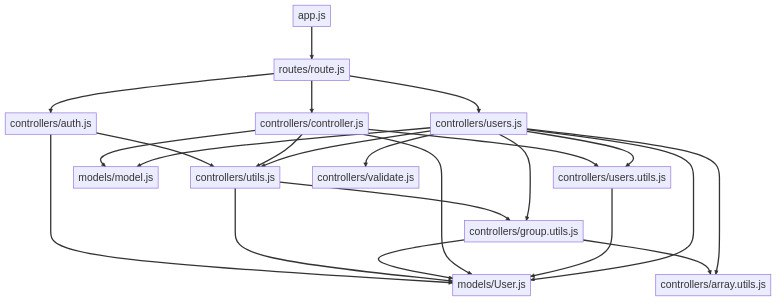
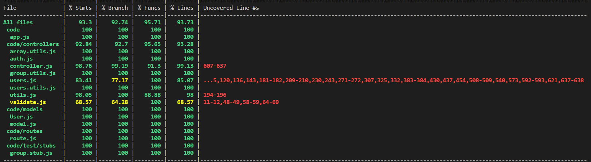

# Test Report

<The goal of this document is to explain how the application was tested, detailing how the test cases were defined and what they cover>

# Contents

- [Test Report](#test-report)
- [Contents](#contents)
- [Dependency graph](#dependency-graph)
- [Integration approach](#integration-approach)
- [Tests](#tests)
- [Coverage](#coverage)
  - [Coverage of FR](#coverage-of-fr)
  - [Coverage white box](#coverage-white-box)

# Dependency graph 

     
# Integration approach
We adopted a bottom-up approach, we started from testing utils.js module, on which the 3 main modules controller.js, users.js, auth.js depend on.
Then we tested the 3 main modules, and, as a consequence of testing the previous ones, also other secondary util modules (validate.js, group.utils.js, array.utils.js) were covered.

Step 1: unit testing of utils.js

Step 2: integration testing of utils.js

Step 3: unit testing of controller.js, users.js, auth.js

Step 4: integration testing of controller.js, users.js, auth.js

Step 5: API testing using Postman

# Tests

   <in the table below list the test cases defined For each test report the object tested, the test level (API, integration, unit) and the technique used to define the test case  (BB/ eq partitioning, BB/ boundary, WB/ statement coverage, etc)>   <split the table if needed>

| Test ID | Test case name | Object(s) tested | Test level | Technique used |
|--|--|--|--|--|
| 1 |Expect to sucessfully create a new transaction|createTransaction|Unit|WB|
| 2 |Expect to fail due to missing body attribute|createTransaction|Unit|WB|
| 3 |Expect to fail due to empty string body attribute|createTransaction|Unit|WB|
| 4 |Expect to fail due to empty string amount attribute|createTransaction|Unit|WB|
| 5 |Expect to return error when user not authenticated|createTransaction|Unit|WB|
| 6 |Expect error due to username mismatch|createTransaction|Unit|WB|
| 7 |Expect user not to be found|createTransaction|Unit|WB|
| 8 |Expected category not to be found|createTransaction|Unit|WB|
| 9 |Expect error due to invalid amount attribute|createTransaction|Unit|WB|
| 10 |Expect to return a server error if an exception occurs|createTransaction|Unit|WB|
| 11 |Expect empty list if no transactions are present|getAllTransactions|Unit|WB|
| 12 |Expect list of transactions|getAllTransactions|Unit|WB|
| 13 |Expect to return error when user is not an admin|getAllTransactions|Unit|WB|
| 14 |Expect to return a server error if an exception occurs|getAllTransactions|Unit|WB|
| 15 |should return transactions for a valid user|getTransactionsByUser|Unit|WB|
| 16 |should return transactions for a valid user asked by an admin|getTransactionsByUser|Unit|WB|
| 17 |should return 400 error if user not found|getTransactionsByUser|Unit|WB|
| 18 |should return 401 error if verifyAuth (authType:User) returns false|getTransactionsByUser|Unit|WB|
| 19 |should return 401 error if verifyAuth (authType:Admin) returns false|getTransactionsByUser|Unit|WB|
| 20 |should return 500 error if exception occurs-1|getTransactionsByUser|Unit|WB|
| 21 |should return 500 error if exception occurs-2|getTransactionsByUser|Unit|WB|
| 22 |should return transactions for a user and category, asked by a user|getTransactionsByUserByCategory|Unit|WB|
| 23 |should return transactions for a user and category, asked by a admin|getTransactionsByUserByCategory|Unit|WB|
| 24 |should return 400 error if the user is not found|getTransactionsByUserByCategory|Unit|WB|
| 25 |should return 400 error if the category is not found|getTransactionsByUserByCategory|Unit|WB|
| 26 |should return 401 error for unauthorized access|getTransactionsByUserByCategory|Unit|WB|
| 27 |should return 500 error if exception occurs|getTransactionsByUserByCategory|Unit|WB|
| 28 |should return list of transactions|getTransactionsByGroup|Unit|WB|
| 29 |should return 400 if group doesnt exist|getTransactionsByGroup|Unit|WB|
| 30 |should return 401 if not authenticated|getTransactionsByGroup|Unit|WB|
| 31 |should return 401 if not Admin|getTransactionsByGroup|Unit|WB|
| 32 |should return list of transactions|getTransactionsByGroupByCategory|Unit|WB|
| 33 |should return 400 if group doesnt exist|getTransactionsByGroupByCategory|Unit|WB|
| 34 |should return 400 if category doesnt exist|getTransactionsByGroupByCategory|Unit|WB|
| 35 |should return 401 if not authenticated|getTransactionsByGroupByCategory|Unit|WB|
| 36 |should return 401 if not Admin|getTransactionsByGroupByCategory|Unit|WB|
| 37 |should delete a transaction and return a success message|deleteTransaction|Unit|WB|
| 38 |should return a 400 error if the request body is missing attributes|deleteTransaction|Unit|WB|
| 39 |should return a 400 error if the user is not found|deleteTransaction|Unit|WB|
| 40 |should return a 400 error if the transaction is not found|deleteTransaction|Unit|WB|
| 41 |should return a 401 error if the user is not authorized|deleteTransaction|Unit|WB|
| 42 |should return a 400 error if user asks to delete a transaction that is not theirs|deleteTransaction|Unit|WB|
| 43 |should return a 500 error if an error occurs|deleteTransaction|Unit|WB|
| 44 |Expected to sucessfully delete many transctions|deleteTransactions|Unit|WB|
| 45 |Expected to be successful with empty array of _ids|deleteTransactions|Unit|WB|
| 46 |Expected to return an error if missing body|deleteTransactions|Unit|WB|
| 47 |Expected to return an error if user is not an Admin|deleteTransactions|Unit|WB|
| 48 |Expected to return an error if an id is an empty string|deleteTransactions|Unit|WB|
| 49 |Expected to return an error if an id is not in the db|deleteTransactions|Unit|WB|
| 50 |Expect to return a server error if an exception occurs|deleteTransactions|Unit|WB|
| 51 |should create a new category successfully|createCategory|Unit|WB|
| 52 |should return an error if user is not authorized|createCategory|Unit|WB|
| 53 |should return an error if type or color is not a string|createCategory|Unit|WB|
| 54 |should return an error if type or color is empty|createCategory|Unit|WB|
| 55 |should return an error if category with the same type already exists|createCategory|Unit|WB|
| 56 |should return a server error if an exception occurs|createCategory|Unit|WB|
| 57 |should update the category and related transactions successfully|updateCategory|Unit|WB|
| 58 |should update the category\s color successfully|updateCategory|Unit|WB|
| 59 |should return an error if user is not authorized|updateCategory|Unit|WB|
| 60 |should return an error if invalid parameter in request|updateCategory|Unit|WB|
| 61 |should return an error if type or color are not strings|updateCategory|Unit|WB|
| 62 |should return an error if type or color are void strings|updateCategory|Unit|WB|
| 63 |should return an error if the category does not exist|updateCategory|Unit|WB|
| 64 |should return an error if category with the same type already exists|updateCategory|Unit|WB|
| 65 |should return a server error if an exception occurs|updateCategory|Unit|WB|
| 66 |Should return an error if user is not authorized|deleteCategory|Unit|WB|
| 67 |Should return an error if types is not an array|deleteCategory|Unit|WB|
| 68 |Should return an error if types is a void array|deleteCategory|Unit|WB|
| 69 |Should return an error if types contains void strings|deleteCategory|Unit|WB|
| 70 |Should return an error if types contains non string elements|deleteCategory|Unit|WB|
| 71 |Should return error 400 if the number of existing categories is <=1|deleteCategory|Unit|WB|
| 72 |Should return error 400 if one of the passed categories does not exist|deleteCategory|Unit|WB|
| 73 |Should delete categories and update transactions when #passed_categories=#db_categories|deleteCategory|Unit|WB|
| 74 |Should delete categories and update transactions when #passed_categories<#db_categories|deleteCategory|Unit|WB|
| 75 |should return a server error if an exception occurs|deleteCategory|Unit|WB|
| 76 |Should return an error if user is not authorized|getCategories|Unit|WB|
| 77 |should return all categories|getCategories|Unit|WB|
| 78 |should return an empty array if there are no categories|getCategories|Unit|WB|
| 79 |should handle and return error 500|getCategories|Unit|WB|
| 80 |Expect to return an empty object without query params|handleDateFilterParams|unit|WB|
| 81 |Expect to return an object with 'from' query|handleDateFilterParams|unit|WB|
| 82 |Expect to return an object with 'upTo' query|handleDateFilterParams|unit|WB|
| 83 |Expect to return an object with 'from' and 'upTo' query|handleDateFilterParams|unit|WB|
| 84 |Expect to return an object with 'date' query|handleDateFilterParams|unit|WB|
| 85 |Expect to throw an error if 'date' and 'from' are present|handleDateFilterParams|unit|WB|
| 86 |Expect to throw an error if 'date' and 'upTo' are present|handleDateFilterParams|unit|WB|
| 87 |Expect to throw an error if 'date' in wrong format|handleDateFilterParams|unit|WB|
| 88 |Expect to throw an error if 'from' in wrong format|handleDateFilterParams|unit|WB|
| 89 |Expect to throw an error if 'upTo' in wrong format|handleDateFilterParams|unit|WB|
| 90 |Should return true for valid simple authentication (authType=Simple)|verifyAuth|unit|WB|
| 91 |Should return false for missing token in req|verifyAuth|unit|WB|
| 92 |Should return false for non valid simple authentication with accessToken missing information (authType=Simple)|verifyAuth|unit|WB|
| 93 |Should return false for non valid simple authentication with refreshToken missing information (authType=Simple)|verifyAuth|unit|WB|
| 94 |Should return false for non valid simple authentication with mismatch of information in the tokens (authType=Simple)|verifyAuth|unit|WB|
| 95 |Should return true when refreshToken not expired and accessToken expired (authType=Simple)|verifyAuth|unit|WB|
| 96 |Should return false when refreshToken expired and accessToken expired (authType=Simple)|verifyAuth|unit|WB|
| 97 |Should return false when refreshToken not valid and accessToken expired (authType=Simple)|verifyAuth|unit|WB|
| 98 |Should return false when error occurs in jwt.verify (authType=Simple)|verifyAuth|unit|WB|
| 99 |Should return true for valid Admin authentication when role == Admin (authType=Admin)|verifyAuth|unit|WB|
| 100 |Should return false for non valid admin authentication with role!=Admin (authType=Admin)|verifyAuth|unit|WB|
| 101 |Should return true when refreshToken not expired and accessToken expired and role == Admin (authType=Admin)|verifyAuth|unit|WB|
| 102 |Should return false when refreshToken not expired and accessToken expired and role != Admin (authType=Admin)|verifyAuth|unit|WB|
| 103 |Should return true for valid User authentication when req.params.username == refreshToken.username == acessToken.username (authType=User)|verifyAuth|unit|WB|
| 104 |Should return false for non valid user authentication when req.params.username != refreshToken.username or != acessToken.username(authType=User)|verifyAuth|unit|WB|
| 105 |Should return true when refreshToken not expired and accessToken expired and req.params.username == refreshToken.username (authType=User)|verifyAuth|unit|WB|
| 106 |Should return false when refreshToken not expired and accessToken expired and req.params.username != refreshToken.username (authType=User)|verifyAuth|unit|WB|
| 107 |Should return true for valid Group authentication when accessToken and refreshToken have a `email` which is in the requested group (authType=Group)|verifyAuth|unit|WB|
| 108 |Should return false for non valid user authentication when accessToken and refreshToken have a `email` which is not the requested group(authType=Group)|verifyAuth|unit|WB|
| 109 |Should return true when refreshToken not expired and accessToken expired and req.params.username == refreshToken.username (authType=User)|verifyAuth|unit|WB|
| 110 |Should return false when refreshToken not expired and accessToken expired and req.params.username != refreshToken.username (authType=User)|verifyAuth|unit|WB|
| 111 |Expect empty object if no query params|handleAmountFilterParams|unit|WB|
| 112 |Expect to return an object with 'min' query|handleAmountFilterParams|unit|WB|
| 113 |Expect to return an object with 'max' query|handleAmountFilterParams|unit|WB|
| 114 |Expect to return an object with 'min' and 'max' query|handleAmountFilterParams|unit|WB|
| 115 |Expect to throw an error if wrong amount format|handleAmountFilterParams|unit|WB|
| 116 |Expect to return an empty object when called without query params|handleDateFilterParams|integration|WB|
| 117 |Expect to return a `date` attribute with `$gte` attribute from `from` query|handleDateFilterParams|integration|WB|
| 118 |Expect to return a `date` attribute with `$lte` attribute from `upTo` query|handleDateFilterParams|integration|WB|
| 119 |Expect to return a `date` attribute with `$lte` and `$gte` from `from` and `upTo` query|handleDateFilterParams|integration|WB|
| 120 |Expect to return a `date` attribute with `$lte` and `$gte` from `date` query|handleDateFilterParams|integration|WB|
| 121 |Expect to throw an error if `date` id present with another attribute|handleDateFilterParams|integration|WB|
| 122 |Expect to throw an error if a query param is in the wrong format|handleDateFilterParams|integration|WB|
| 123 |Should return true for valid simple authentication (authType=Simple)|verifyAuth|integration|WB|
| 124 |Should return false for missing token in req|verifyAuth|integration|WB|
| 125 |Should return false for non valid simple authentication with accessToken missing username information (authType=Simple)|verifyAuth|integration|WB|
| 126 |Should return false for non valid simple authentication with accessToken missing email information (authType=Simple)|verifyAuth|integration|WB|
| 127 |Should return false for non valid simple authentication with accessToken missing role information (authType=Simple)|verifyAuth|integration|WB|
| 128 |Should return false for non valid simple authentication with refreshToken missing username information (authType=Simple)|verifyAuth|integration|WB|
| 129 |Should return false for non valid simple authentication with refreshToken missing email information (authType=Simple)|verifyAuth|integration|WB|
| 130 |Should return false for non valid simple authentication with refreshToken missing role information (authType=Simple)|verifyAuth|integration|WB|
| 131 |Should return false for non valid simple authentication with mismatch of username in the tokens (authType=Simple)|verifyAuth|integration|WB|
| 132 |Should return false for non valid simple authentication with mismatch of email in the tokens (authType=Simple)|verifyAuth|integration|WB|
| 133 |Should return false for non valid simple authentication with mismatch of role in the tokens (authType=Simple)|verifyAuth|integration|WB|
| 134 |Should return true when refreshToken not expired and accessToken expired (authType=Simple)|verifyAuth|integration|WB|
| 135 |Should return false when refreshToken expired and accessToken expired (authType=Simple)|verifyAuth|integration|WB|
| 136 |Should return false when refreshToken is missing username information and accessToken expired (authType=Simple)|verifyAuth|integration|WB|
| 137 |Should return false when refreshToken is missing email information and accessToken expired (authType=Simple)|verifyAuth|integration|WB|
| 138 |Should return false when refreshToken is missing role information and accessToken expired (authType=Simple)|verifyAuth|integration|WB|
| 139 |Should return false when accessToken expired and error occurs in jwt.verify (authType=Simple)|verifyAuth|integration|WB|
| 140 |Should return false when error occurs in jwt.verify (authType=Simple)|verifyAuth|integration|WB|
| 141 |Should return true for valid Admin authentication when role == Admin (authType=Admin)|verifyAuth|integration|WB|
| 142 |Should return false for non valid admin authentication with role!=Admin (authType=Admin)|verifyAuth|integration|WB|
| 143 |Should return true when refreshToken not expired and accessToken expired and role == Admin (authType=Admin)|verifyAuth|integration|WB|
| 144 |Should return false when refreshToken not expired and accessToken expired and role != Admin (authType=Admin)|verifyAuth|integration|WB|
| 145 |Should return true for valid User authentication when req.params.username == refreshToken.username == acessToken.username (authType=User)|verifyAuth|integration|WB|
| 146 |Should return false for non valid user authentication when req.params.username != refreshToken.username or != acessToken.username(authType=User)|verifyAuth|integration|WB|
| 147 |Should return true when refreshToken not expired and accessToken expired and req.params.username == refreshToken.username (authType=User)|verifyAuth|integration|WB|
| 148 |Should return false when refreshToken not expired and accessToken expired and req.params.username != refreshToken.username (authType=User)|verifyAuth|integration|WB|
| 149 |Should return true for valid Group authentication when accessToken and refreshToken have a `email` which is in the requested group (authType=Group)|verifyAuth|integration|WB|
| 150 |Should return false for non valid user authentication when accessToken and refreshToken have a `email` which is not the requested group(authType=Group)|verifyAuth|integration|WB|
| 151 |Should return true when refreshToken not expired and accessToken expired and refreshToken has an email which is in the requested group (authType=Group)|verifyAuth|integration|WB|
| 152 |Should return false when refreshToken not expired and accessToken expired and refreshToken has an email which is not in the requested group (authType=Group)|verifyAuth|integration|WB|
| 153 |Expect to return empty object if no query params are passed|handleAmountFilterParams|integration|WB|
| 154 |Expect to return an `amount` attribute with `$gte` from `min` query|handleAmountFilterParams|integration|WB|
| 155 |Expect to return an `amount` attribute with `$lte` from `max` query|handleAmountFilterParams|integration|WB|
| 156 |Expect to return an `amount` attribute with `$gte` and `$lte` from `min` and `max` query|handleAmountFilterParams|integration|WB|
| 157 |Expect to throw an error if amount is in the wrong format|handleAmountFilterParams|integration|WB|
| 158 | should create a new category successfully                      | createCategory  | integration  | WB             |
| 159 | should return an error if user is not authorized               | createCategory  | integration  | WB             |
| 160 | should return an error if type or color is not a string        | createCategory  | integration  | WB             |
| 161 | should return an error if type or color is empty               | createCategory  | integration  | WB             |
| 162 | should return an error if category with the same type exists   | createCategory  | integration  | WB             |
| 163 ||
| 164 | should update the category and related transactions successfully | updateCategory  | integration  | WB             |
| 165 | should update the category's color successfully            | updateCategory  | integration  | WB             |
| 166 | should return an error if user is not authorized           | updateCategory  | integration  | WB             |
| 167 | should return an error if invalid parameter in request     | updateCategory  | integration  | WB             |
| 168 | should return an error if type or color are not strings    | updateCategory  | integration  | WB             |
| 169 | should return an error if type or color are void strings   | updateCategory  | integration  | WB             |
| 170 | should return an error if the category does not exist      | updateCategory  | integration  | WB             |
| 171 | should return an error if category with the same type already exists | updateCategory  | integration  | WB             |
| 172 ||
| 173 | should return an error if user is not authorized                     | deleteCategory  | integration  | WB             |
| 174 | Should return an error if types is not an array                      | deleteCategory  | integration  | WB             |
| 175 | Should return an error if types is a void array                      | deleteCategory  | integration  | WB             |
| 176 | Should return an error if types contains void strings                | deleteCategory  | integration  | WB             |
| 177 | Should return an error if types contains non-string elements         | deleteCategory  | integration  | WB             |
| 178 | Should return error 400 if the number of existing categories is <=1   | deleteCategory  | integration  | WB             |
| 179 | Should return error 400 if one of the passed categories does not exist | deleteCategory  | integration  | WB             |
| 180 | Should delete categories and update transactions when #passed_categories=#db_categories | deleteCategory  | integration  | WB             |
| 181 | Should delete categories and update transactions when #passed_categories<#db_categories-1 | deleteCategory  | integration  | WB             |
| 182 | Should delete categories and update transactions when #passed_categories<#db_categories-2 | deleteCategory  | integration  | WB             |
| 183 ||
| 184 | should return all categories            | getCategories  | integration | WB             |
| 185 | should return an empty array if there are no categories | getCategories | integration | WB             |
| 186 ||
| 187 | Expect to successfully create a new transaction             | createTransaction | integration | WB             |
| 188 | Expect to return an error if 'username' is not given       | createTransaction | integration | WB             |
| 189 | Expect to return an error if 'username' is empty           | createTransaction | integration | WB             |
| 190 | Expect to return an error if 'amount' is empty             | createTransaction | integration | WB             |
| 191 | Expect to return an error if 'amount' is not a number      | createTransaction | integration | WB             |
| 192 | Expect to return an error if not logged in                 | createTransaction | integration | WB             |
| 193 | Expected to return an error if logged in, but not as the user in the path | createTransaction | integration | WB             |
| 194 | Expected to return an error if username mismatch between path and body | createTransaction | integration | WB             |
| 195 | Expected to return an error if the user is not found in the database | createTransaction | integration | WB             |
| 196 | Expected to return an error if the category is not found    | createTransaction | integration | WB             |
| 197 | Should check authentication before other types of errors   | createTransaction | integration | WB             |
| 198 ||
| 199 | Expect to return a list with all transactions               | getAllTransactions | integration  | WB               |
| 200 | Expect to return an empty list if no transactions are present | getAllTransactions | integration  | WB               |
| 201 | Expect to return an error if the user is not an Admin        | getAllTransactions | integration  | WB               |
| 202 ||
| 203 | should return non-filtered user transactions                                  | getTransactionsByUser | integration | WB              |
| 204 | should return empty array if there are no user transactions                    | getTransactionsByUser | integration | WB              |
| 205 | should return filtered user transactions based on query param "from"          | getTransactionsByUser | integration | WB              |
| 206 | should return filtered user transactions based on query param "upTo"          | getTransactionsByUser | integration | WB              |
| 207 | should return filtered user transactions based on query param "from" and "upTo" | getTransactionsByUser | integration | WB              |
| 208 | should return filtered user transactions based on query param "date"          | getTransactionsByUser | integration | WB              |
| 209 | should return an error if date and from are both provided                     | getTransactionsByUser | integration | WB              |
| 210 | should return an error if date and upTo are both provided                     | getTransactionsByUser | integration | WB              |
| 211 | should return an error if from is a non-valid date string                     | getTransactionsByUser | integration | WB              |
| 212 | should return an error if upTo is a non-valid date string                     | getTransactionsByUser | integration | WB              |
| 213 | should return an error if date is a non-valid date string                     | getTransactionsByUser | integration | WB              |
| 214 | should return filtered user transactions based on query param "min"           | getTransactionsByUser | integration | WB              |
| 215 | should return filtered user transactions based on query param "max"           | getTransactionsByUser | integration | WB              |
| 216 | should return filtered user transactions based on query params "min" and "max" | getTransactionsByUser | integration | WB              |
| 217 | should return an error if min is not a number                                 | getTransactionsByUser | integration | WB              |
| 218 | should return an error if max is not a number                                 | getTransactionsByUser | integration | WB              |
| 219 | should return an empty transactions array if min is greater than max          | getTransactionsByUser | integration | WB              |
| 220 | should return filtered user transactions based on query params "min", "max", "from" and "upTo" | getTransactionsByUser | integration | WB              |
| 221 | should return an error if the user is not the owner of the transactions       | getTransactionsByUser | integration | WB              |
| 222 | should return an error if users is not logged in                              | getTransactionsByUser | integration | WB              |
| 223 | should return all transactions of the requested user if the user is admin     | getTransactionsByUser | integration | WB              |
| 224 | should return all transactions of the requested user if the user is admin even if query params are provided | getTransactionsByUser | integration | WB              |
| 225 | should return empty array if there no transactions of the requested user and the user is admin | getTransactionsByUser | integration | WB              |
| 226 | should return an error if the user is not admin                               | getTransactionsByUser | integration | WB              |
| 227 | should return an error if the user does not exist and route is admin route    | getTransactionsByUser | integration | WB              |
| 228 | should return an error if users is not logged in                              | getTransactionsByUser | integration | WB              |
| 229 | should not let an admin through user route                                    | getTransactionsByUser | integration | WB              |
| 230 | should not let a user through admin route                                    | getTransactionsByUser | integration | WB              |
| 231 ||
| 232 | should return all transactions of a user filtered by given category                                          | getTransactionsByUserByCategory            | integration   | WB             |
| 233 | should return empty array if there are no transactions for the user in the given category                  | getTransactionsByUserByCategory            | integration   | WB             |
| 234 | should return error 400 if category does not exist                                                          | getTransactionsByUserByCategory            | integration   | WB             |
| 235 | should return error 401 if called by an authenticated user that is not the owner of the transactions       | getTransactionsByUserByCategory            | integration   | WB             |
| 236 | should return error 401 if called by an unauthenticated user                                                | getTransactionsByUserByCategory            | integration   | WB             |
| 237 | should return all transactions of the requested user with given category, asked by admin                   | getTransactionsByUserByCategory            | integration   | WB             |
| 238 | should return empty array if there are no transactions for the requested user in the given category, asked by admin | getTransactionsByUserByCategory       | integration   | WB             |
| 239 | should return error 400 if category does not exist, asked by admin                                          | getTransactionsByUserByCategory            | integration   | WB             |
| 240 | should return error 400 if user does not exist, asked by admin                                             | getTransactionsByUserByCategory            | integration   | WB             |
| 241 | should return error 401 if called by a non-admin user                                                       | getTransactionsByUserByCategory            | integration   | WB             |
| 242 | should return error 401 if called by an unauthenticated user                                               | getTransactionsByUserByCategory            | integration   | WB             |
| 243 | should not let an admin through user route                                                                 | getTransactionsByUserByCategory            | integration   | WB             |
| 244 | should not let a user through admin route                                                                 | getTransactionsByUserByCategory            | integration   | WB             |
| 245 | should check authentication before other types of errors                                                   | getTransactionsByUserByCategory            | integration   | WB             |
| 246 ||
| 247 | should return transactions                               | getTransactionsByGroup  | integration  | WB              |
| 248 | should return error if group doesn't exist                | getTransactionsByGroup  | integration  | WB              |
| 249 | should return 401 is user is not part of the group        | getTransactionsByGroup  | integration  | WB              |
| 250 | should return 401 if not Admin role                       | getTransactionsByGroup  | integration  | WB              |
| 251 | should return transaction if Admin                        | getTransactionsByGroup  | integration  | WB              |
| 252 ||
| 253 | should return list of transactions                          | getTransactionByGroupByCategory | integration   | WB             |
| 254 | should return error if group doesn't exist                  | getTransactionByGroupByCategory | integration   | WB             |
| 255 | should return 400 if category doesn't exist                 | getTransactionByGroupByCategory | integration   | WB             |
| 256 | should return 401 is user is not part of the group          | getTransactionByGroupByCategory | integration   | WB             |
| 257 | should return 401 if not Admin role                         | getTransactionByGroupByCategory | integration   | WB             |
| 258 | should return transaction if Admin                          | getTransactionByGroupByCategory | integration   | WB             |
| 259 ||
| 260 | Should successfully delete a transaction | deleteTransaction | integration | WB |
| 261 | should return error 400 if _id in body is not defined | deleteTransaction | integration | WB |
| 262 | should return error 400 if _id in body is an empty string | deleteTransaction | integration | WB |
| 263 | should return error 400 if _id in body is not a string | deleteTransaction | integration | WB |
| 264 | should return error 500 if _id in body is not a valid ObjectId | deleteTransaction | integration | WB |
| 265 | should return error 400 if username passed as params does not exist in the DB | deleteTransaction | integration | WB |
| 266 | should return error 400 if the _id (transaction) in the body does not exist in the DB | deleteTransaction | integration | WB |
| 267 | should return error 400 if the _id (transaction) in the body does not belong to the user | deleteTransaction | integration | WB |
| 268 | should return error 401 if called by a non-authenticated user | deleteTransaction | integration | WB |
| 269 | should error 401 if called by an authenticated user who is not the same as the one in the route (authType=user) | deleteTransaction | integration | WB |
| 270 | should check authentication before other types of errors | deleteTransaction | integration | WB |
| 271 ||
| 272 | Expected to delete some transactions                                     | deleteTransactions  | integration  | WB             |
| 273 | Expected to be successful with empty array                              | deleteTransactions  | integration  | WB             |
| 274 | Expected to return an error if not logged in                            | deleteTransactions  | integration  | WB             |
| 275 | Expected to return an error if not logged in as an Admin                | deleteTransactions  | integration  | WB             |
| 276 | Expected to return an error if missing '_ids' attribute                 | deleteTransactions  | integration  | WB             |
| 277 | Expected to return an error if an _id is an empty string                | deleteTransactions  | integration  | WB             |
| 278 | Expected to return an error if an _id is an invalid string              | deleteTransactions  | integration  | WB             |
| 279 | Expected to return an error if a transaction is not found               | deleteTransactions  | integration  | WB             |
| 280 | Should check authentication before other types of errors               | deleteTransactions  | integration  | WB             |
| 281 ||
| 282 ||
| 283 | should register a new user and return success message            | register        | integration  | WB             |
| 284 | should return an error if the user email is already registered   | register        | integration  | WB             |
| 285 | should return an error if the user username is already registered| register        | integration  | WB             |
| 286 | should return an error if the email is not a valid email         | register        | integration  | WB             |
| 287 | should return an error if username is missing in req.body        | register        | integration  | WB             |
| 288 | should return an error if email is missing in req.body           | register        | integration  | WB             |
| 289 | should return an error if password is missing in req.body        | register        | integration  | WB             |
| 290 | should return an error if username is empty in req.body          | register        | integration  | WB             |
| 291 | should return an error if email is empty in req.body             | register        | integration  | WB             |
| 292 | should return an error if password is empty in req.body          | register        | integration  | WB             |
| 293 | should return an error if an element is not a string in req.body | register        | integration  | WB             |
| 294 ||
| 295 | should register a new admin and return success message | registerAdmin | integration | WB |
| 296 | should return an error if the admin email is already registered | registerAdmin | integration | WB |
| 297 | should return an error if the admin username is already registered | registerAdmin | integration | WB |
| 298 | should return an error if the email is not a valid email | registerAdmin | integration | WB |
| 299 | should return an error if username is missing in req.body | registerAdmin | integration | WB |
| 300 | should return an error if email is missing in req.body | registerAdmin | integration | WB |
| 301 | should return an error if password is missing in req.body | registerAdmin | integration | WB |
| 302 | should return an error if username is empty in req.body | registerAdmin | integration | WB |
| 303 | should return an error if email is empty in req.body | registerAdmin | integration | WB |
| 304 | should return an error if password is empty in req.body | registerAdmin | integration | WB |
| 305 | should return an error if an element is not a string in req.body | registerAdmin | integration | WB |
| 306 ||
| 307 | should log in a user and return access and refresh tokens | login | integration | WB |
| 308 | should return an error if the user does not exist | login | integration | WB |
| 309 | should return an error if the password is incorrect | login | integration | WB |
| 310 | should return an error if the email is not a valid email | login | integration | WB |
| 311 | should return an error if email is missing in req.body | login | integration | WB |
| 312 | should return an error if password is missing in req.body | login | integration | WB |
| 313 | should return an error if email is empty in req.body | login | integration | WB |
| 314 | should return an error if password is empty in req.body | login | integration | WB |
| 315 | should return an error if an element is not a string in req.body | login | integration | WB |
| 316 ||
| 317 | should log out a user and return a success message         | logout          | integration   | WB             |
| 318 | should return an error if the user is not found           | logout          | integration   | WB             |
| 319 | should return an error if the refresh token is not provided | logout          | integration   | WB             |
| 320 ||
| 321 ||
| 322 ||
| 323 | returns false if body is missing attributes              | isValidBody     | unit  | WB             |
| 324 | returns false if body contains empty string              | isValidBody     | unit  | WB             |
| 325 | returns false if body contains string with only space    | isValidBody     | unit  | WB             |
| 326 | returns false if body contains element which is not a string | isValidBody  | unit  | WB             |
| 327 | returns true if body contains all necessary attributes   | isValidBody     | unit  | WB             |
| 328 ||
| 329 | returns true for a valid email address          | isValidEmail     | unit | WB             |
| 330 | returns false for an invalid email address      | isValidEmail     | unit | WB             |
| 331 ||
| 332 | Should register a new user and return a success message           | register        | unit       | WB             |
| 333 | Should return an error message if the user is already registered  | register        | unit       | WB             |
| 334 | Should return an error if an exception occurs                     | register        | unit       | WB             |
| 335 ||
| 336 | should register a new admin user and return a success message | registerAdmin | unit | WB |
| 337 | should return an error message if the admin user is already registered | registerAdmin | unit | WB |
| 338 | should return an error if an exception occurs | registerAdmin | unit | WB |
| 339 ||
| 340 | should perform login and return access token and refresh token | login           | unit       | WB             |
| 341 | should return an error message if the user does not exist | login           | unit       | WB             |
| 342 | should return an error message if the supplied password does not match | login           | unit       | WB             |
| 343 | should return an error if an exception occurs             | login           | unit       | WB             |
| 344 ||
| 345 | should perform logout and clear cookies | logout | unit | WB |
| 346 | should return an error message if the user does not exist | logout | unit | WB |
| 347 | should return an error message if there is no refreshToken in the request | logout | unit | WB |
| 348 | should return an error if an exception occurs | logout | unit | WB |
| 349 | should retrieve list of all users | getUsers | Unit | WB |
| 350 | getUser | getUsers | Unit | WB |
| 351 | should return a user | getUsers | Unit | WB |
| 352 | should return error if user doesn't exist | getUsers | Unit | WB |
| 353 | deleteUser | getUsers | Unit | WB |
| 354 | should delete a user | getUsers | Unit | WB |
| 355 | result status should be 200 | createGroup | Unit | WB |
| 356 | result status should be 400 when group already exists | createGroup | Unit | WB |
| 357 | result status should be 400 when all users don't exists | createGroup | Unit | WB |
| 358 | result status should be 400 when all user belong to a group or don't exist | createGroup | Unit | WB |
| 359 | result should get non-exising users and already in a group | createGroup | Unit | WB |
| 360 | should return a list of all groups | getGroups | Unit | WB |
| 361 | should return an empty list | getGroups | Unit | WB |
| 362 | should return a group | getGroup | Unit | WB |
| 363 | should return 400 when the group does not exist | getGroup | Unit | WB |
| 364 | should return the updated group | addToGroup | Unit | WB |
| 365 | sould return 400 if group does not exist | addToGroup | Unit | WB |
| 366 | result status should be 400 when all users don't exists | addToGroup | Unit | WB |
| 367 | result status should be 400 when all user belong to a group or don't exist | addToGroup | Unit | WB |
| 368 | result should get non-exising users and already in a group | addToGroup | Unit | WB |
| 369 | should return the updated group | removeFromGroup | Unit | WB |
| 370 | sould return 400 if group does not exist | removeFromGroup | Unit | WB |
| 371 | result status should be 400 when all users don't exists | removeFromGroup | Unit | WB |
| 372 | result status should be 400 when all users don't belong to a group or don't exist | removeFromGroup | Unit | WB |
| 373 | result should get non-exising users and not in a group | removeFromGroup | Unit | WB |

# Coverage

## Coverage of FR

<Report in the following table the coverage of  functional requirements (from official requirements) >

| Functional Requirements covered |   Test(s) | 
| ------------------------------- | ----------- | 
| FRx                             |             |             
| FRy                             |             | 
| ... ||

## Coverage white box

